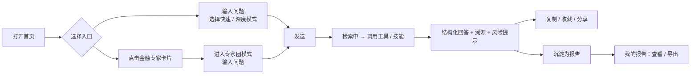
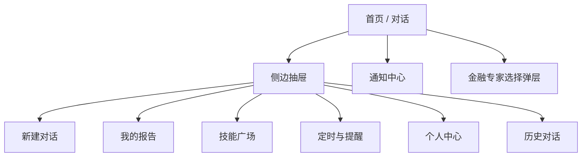

# 玑衡AI 产品需求文档（PRD）

2026-09-22 · @Lurnings

## 1. 文档信息

本文档基于高保真交互原型《玑衡AI\_原型\_dc.html》逆向整理，覆盖移动端 v1.0 全部页面与交互流。对应的技术实施方案见《[玑衡AI 实施计划](玑衡AI%20实施计划.md)》。

| 项目 | 内容 |
| --- | --- |
| 产品名称 | 玑衡AI（Slogan：你的智能金融操作系统） |
| 文档版本 | v0.1（草稿） |
| 原型版本 | 原型内「关于」项显示 v2.4.1，按 iPhone 375×812 尺寸设计 |
| 目标平台 | 移动端 App（Flutter，iOS / Android） |
| 后端 / Agent | Agent 服务 Python + DeepSeek Harness（dsh）；业务 CRUD 服务 Java；存储先落本地 SQLite |
| 原型技术形态 | DC 声明式模板 + 脚本化对话流（`SCRIPTS`），5 条预置对话脚本 + 1 条通用兜底 |

**修订记录**

| 日期 | 版本 | 修订内容 | 修订人 |
| --- | --- | --- | --- |
| 2026-09-22 | v0.1 | 依据原型首次整理 PRD 全文 | Lurnings |

## 2. 产品概述

玑衡AI 是一款对话式金融投研 Agent 移动应用：以「一个输入框 + 三种模式」承接用户的全部投研意图，接入实时行情、研究数据与自动化金融 Agent，产出带溯源、带风险提示的结构化分析与报告。

### 2.1 背景

- 个人投资者与买方研究员的投研工作高度碎片化：查行情、翻研报、看公告、做归因分散在多个工具，缺少统一入口。
- 通用大模型问答缺少金融数据接入、缺少溯源、缺少风险合规约束，无法直接用于投研场景。
- 「技能（Skill）」形态可以把机构沉淀的分析框架（如板块透视、期权波动率诊断）封装为可复用能力，降低专业分析门槛。

### 2.2 产品定位

- 定位为**研究辅助与投资教育工具**，不提供个股买卖建议；所有 AI 输出末尾强制附带风险提示与「内容由 AI 生成，请核查重要信息」声明。
- 目标形态为「智能金融操作系统」：对话为主入口，技能广场、报告库、定时/提醒、金融专家团为四个能力扩展面。
- 原型账号体系体现「机构版 · 研究部」，说明产品同时面向机构研究团队与个人专业用户（详见第 11 节待确认项）。

### 2.3 核心价值

| 价值点 | 原型体现 |
| --- | --- |
| 一站式投研入口 | 首页对话框 + 金融专家卡片，一键进入专家协作 |
| 多层次分析深度 | 快速问答 / 深度研究 / 金融专家团三档模式 |
| 可溯源、可核查 | 每条回答显示「参考了 N 个资料」，可展开查看来源标题、类型、日期 |
| 能力可沉淀、可复用 | 官方技能 36 个 + 用户自建技能，支持开关与新建 |
| 结果可留存、可分发 | 报告库按类型归档，支持查看与导出；晨报可自动发送 |
| 自动化 | 定时任务 + 条件触发提醒，配合通知中心闭环 |

### 2.4 产品目标（v1.0）

1. 跑通「提问 → 检索 / 调用技能 → 结构化回答 → 沉淀为报告」的完整闭环。
2. 上线三种对话模式与 6 类金融专家角色的选择与切换。
3. 上线技能广场（官方 + 自建）与报告库的浏览、筛选、导出。
4. 完成定时任务、提醒任务、通知中心的框架页面与空态；具体自动化编排能力可在 v1.1 迭代。

## 3. 目标用户与使用场景

### 3.1 用户画像

| 角色 | 典型身份 | 核心诉求 | 原型对应 |
| --- | --- | --- | --- |
| 买方 / 卖方研究员 | 机构研究部成员（原型：USER\_6450，机构版 · 研究部） | 快速梳理事件驱动、生成研报草稿、跟踪产业链 | 深度研究模式、个股 / 行业研究专家、报告库 |
| 投资顾问 / 理财师 | 面向客户的销售与服务人员 | 晨会纪要、客户问题快答、产品解读 | 财富管理专家、客户晨会纪要技能、晨报 |
| 组合管理者 / 交易员 | 管理持仓的专业投资者 | 周度归因、盘中异动归因、资金流向监测 | 组合周度复盘技能、期货异动归因、提醒任务 |
| 专业个人投资者 | 有一定金融基础的个人用户 | 看懂板块涨跌、基金 / 期权知识解读 | 快速问答、今日热搜、基金涨跌解读技能 |

### 3.2 核心场景

1. **热点事件快答**：用户输入板块或个股问题（如「创新药板块集体大涨的核心驱动因素是什么」），系统聚合搜索后返回「驱动因素 → 板块表现表 → 机构观点 → 风险提示」的结构化回答。
2. **技能驱动分析**：用户在输入中指名技能（如「用贵金属板块深度透视技能分析金银比」），系统调用技能并按技能框架输出分位、均值等量化结论。
3. **专家协作**：用户点击首页金融专家卡片（或模式行「金融专家团」）选择「研报专家」，直接进入专家团模式，围绕研报、财报、会议等垂直任务展开多轮对话。
4. **报告沉淀与导出**：深度研究结果自动归档到「我的报告」，按深度研究 / 公司研究 / 晨报分类，可查看、导出。
5. **自动化订阅**：用户在对话中表达「当 X 满足条件时提醒我」，系统创建提醒任务；到期或触发后通过通知中心送达。

### 3.3 用户旅程（主流程）

主流程共 4 步到达结果：进入首页、选择或输入问题、确认模式、发送；回答分「检索中 → 工具调用 → 引言 → 正文」四个阶段渐进呈现。

## 4. 产品范围

### 4.1 本期范围（v1.0，以原型为准）

| 模块 | 包含 | 优先级 |
| --- | --- | --- |
| 首页 / 对话 | 欢迎语、金融专家卡片、消息流、三模式切换、专家选择、输入区 | P0 |
| 侧边抽屉 | 新建对话、我的报告、技能广场、定时与提醒、历史对话搜索与分组、账号入口 | P0 |
| 我的报告 | 类型 Tab 筛选、时间分组、报告卡片、查看、导出 | P0 |
| 技能广场 | 三个 Tab（已开启的 / 我创建的 / 官方技能）、搜索、开关、新建技能入口、空态 | P0 |
| 金融专家团 | 6 类专家的半屏选择弹层、搜索、选中态、与模式联动 | P0 |
| 个人中心 | 账号信息、统计数据、6 项设置入口、退出登录 | P1 |
| 定时与提醒 | 定时任务 / 提醒任务两个分区、创建入口、空态 | P1（框架） |
| 通知中心 | 任务记录列表、空态 | P1（框架） |

### 4.2 本期不做

- 不提供交易下单、持仓同步、资金划转等任何交易类功能。
- 不做个股买卖评级或目标价的自有判断，仅转述并标注机构观点来源。
- 不做新建技能的编辑器、定时任务的创建表单（原型仅有入口与空态，交互细节待 v1.1）。
- 不做多端同步与团队协作（评论、共享报告）。
- 不做行情 K 线、自选股等传统行情软件功能。

### 4.3 术语表

| 术语 | 定义 |
| --- | --- |
| 模式（Mode） | 单次对话的处理策略，分快速问答 / 深度研究 / 金融专家团三种，影响检索深度与输出形态 |
| 技能（Skill） | 封装好的分析流程与提示框架，分官方技能与用户自建技能，可开关；对话中被显式或隐式调用 |
| 金融专家（Expert） | 专家团模式下的角色化 Agent，如会议专家、研报专家，带专属任务边界与工具集 |
| 工具（Tool） | Agent 执行时调用的外部能力，原型中体现为「聚合搜索」及技能名 |
| 溯源（Reference） | 回答底部可展开的资料引用列表，含标题、类型标签（如「数据」）、日期 |
| 报告（Report） | 由深度研究、公司研究、晨报等流程产出的可归档文档，含页数与引用条数 |
| 定时任务 | 用户设定的按时间周期自动执行的任务（如每日晨报） |
| 提醒任务 | 通过对话创建的条件订阅，满足条件后触发通知 |

## 5. 信息架构与页面结构

应用采用「单页主对话 + 侧边抽屉导航 + 二级全屏页」结构，无底部 Tab 栏；所有二级页通过左上角「‹」返回首页。

### 5.1 页面清单

| 页面 ID | 页面名称 | 入口 | 状态变量（原型） | 说明 |
| --- | --- | --- | --- | --- |
| PG-01 | 首页 / 对话 | 默认落地页；抽屉「新建对话」；历史对话项 | `page='home'` | 顶栏（菜单、品牌、通知铃铛）+ 滚动消息区 + 底部输入区 |
| PG-02 | 侧边抽屉 | 首页左上角菜单按钮 | `drawerOpen` | 左侧 Overlay，点击遮罩关闭 |
| PG-03 | 我的报告 | 抽屉 | `page='reports'` | 类型 Tab + 时间分组列表 |
| PG-04 | 技能广场 | 抽屉 | `page='skills'` | 三 Tab + 搜索 + 技能列表 |
| PG-05 | 定时与提醒 | 抽屉 | `page='reminders'` | 两分区 + 空态 |
| PG-06 | 个人中心 | 抽屉底部账号卡 | `page='profile'` | 账号卡 + 统计 + 设置列表 |
| PG-07 | 通知中心 | 首页右上角铃铛 | `page='notifications'` | 任务记录 + 空态 |
| PG-08 | 金融专家选择弹层 | 模式行「金融专家团」 | `expertSheet` | 底部半屏 Sheet，点击遮罩或 ✕ 关闭 |

### 5.2 页面流转规则

- 抽屉内任意导航项点击后：切换 `page` 并关闭抽屉（`go(page)` 原子操作）。
- 「新建对话」与历史对话项均回到首页；原型中历史对话不恢复消息流（v1.0 需补齐会话恢复，见第 11 节）。
- 二级页均为全屏替换首页内容区，非栈式导航；返回键仅回首页。
- 专家弹层与抽屉均为 Overlay，关闭不改变当前页面。
- 顶部状态栏（时钟、信号、Wi-Fi、电量）为原型模拟，实际由系统提供。

## 6. 功能需求详述

功能编号规则：`F-<模块>-<序号>`；优先级 P0 = v1.0 必须，P1 = v1.0 应有，P2 = 可延后。

### 6.1 首页与对话（HOME）

| 编号 | 功能点 | 优先级 | 需求描述与规则 |
| --- | --- | --- | --- |
| F-HOME-01 | 顶栏 | P0 | 左：菜单按钮（打开抽屉）；中：品牌名「玑衡AI」+ 副标题「你的智能金融操作系统」；右：通知铃铛（跳通知中心） |
| F-HOME-02 | 欢迎语 | P0 | 首条 AI 消息固定文案：「已为你接入实时行情、研究数据与自动化金融 Agent，今天想做什么？」；头像为「玑」字圆形标识 |
| F-HOME-03 | 金融专家卡片 | P0 | 欢迎语下方展示 6 位金融专家卡片（会议、个股研究、行业研究、财富管理、研报、舆情），每张含首字头像（独立底色）、名称、一行描述。点击卡片直接选中该专家：`mode='expert'`、`modeSelected=true`，已选 Chip 显示「金融专家团 · {专家名}」，Placeholder 切换为专家团文案，与 F-EXP-04 行为一致。专家数据与 F-EXP-03 共用同一配置 |
| F-HOME-04 | 模式选择行 | P0 | 输入区上方展示三枚 Chip：快速问答 / 深度研究 / 金融专家团。选中后模式行收起，改为显示「已选模式 Chip + ✕」；✕ 恢复默认（快速问答，专家清空）。点击「金融专家团」不直接选中，而是打开专家弹层 |
| F-HOME-05 | 输入区 | P0 | 左「＋」附件按钮（v1.0 占位），中多行 textarea，右发送按钮。Placeholder 随模式变化（见 7.5 文案）。输入非空时发送按钮由「＋」灰底变为「↑」深色实心；空输入禁止发送 |
| F-HOME-06 | 用户消息气泡 | P0 | 右对齐深色气泡，纯文本 |
| F-HOME-07 | AI 回答渐进呈现 | P0 | 分四阶段：阶段 0「正在检索……」；阶段 1 显示工具 / 技能行 + 引言；阶段 2 工具行显示实际查询语句并打 ✓；阶段 3 展开正文。原型延时 0.9s / 2.1s / 3.5s，实际应由流式事件驱动 |
| F-HOME-08 | 工具调用行 | P0 | 非技能流：显示工具名（如「聚合搜索」）+ 查询语句（阶段 1 为「正在生成搜索问句…」，阶段 2 替换为实际问句）+ 状态（busy 为旋转指示、done 为 ✓）。技能流：显示「已调用技能 · {技能名}」 |
| F-HOME-09 | 结构化正文 | P0 | 由若干 Section 组成，每个 Section 含小标题 `h`、可选段落 `para`、可选要点列表 `items`；末尾可追加「机构核心观点」段。支持 Key-Value 数据表（`tableTitle` + `tableRows`） |
| F-HOME-10 | 风险提示 | P0 | 正文末尾固定展示 `risk` 文案，须以「以上分析仅供参考，不构成投资建议」收尾；服务端生成时强制校验 |
| F-HOME-11 | 溯源折叠 | P0 | 行文案「本次回答参考了 N 个资料 ⌄」，点击展开来源列表（原型仅展示首条：标题、标签「数据」、日期）。v1.0 需展示全部 N 条并支持点击跳转原文 |
| F-HOME-12 | AI 声明 | P0 | 每条回答底部固定「内容由 AI 生成，请核查重要信息」 |
| F-HOME-13 | 消息操作 | P1 | 复制 ⧉ / 收藏 ♡ / 分享 ↗ 三个图标按钮；复制取正文纯文本，收藏进入报告库或收藏夹（待定），分享调用系统分享 |
| F-HOME-14 | 自动滚动 | P0 | 发送与每阶段更新后消息区滚动到底部 |
| F-HOME-15 | 会话状态 | P0 | 发送后输入框清空；模式与专家保持选中，直至用户点击 ✕ 重置 |

### 6.2 金融专家团（EXPERT）

| 编号 | 功能点 | 优先级 | 需求描述与规则 |
| --- | --- | --- | --- |
| F-EXP-01 | 专家弹层 | P0 | 底部半屏 Sheet，标题「选择金融专家」，右上 ✕；点击遮罩关闭 |
| F-EXP-02 | 专家搜索 | P1 | 搜索框占位「搜索金融专家」，按名称 / 描述模糊匹配 |
| F-EXP-03 | 专家列表 | P0 | 6 个专家：会议专家、个股研究专家、行业研究专家、财富管理专家、研报专家、舆情专家；每项含首字头像（独立底色）、名称、一行描述（超长截断）；选中项右侧 ✓ |
| F-EXP-04 | 选中联动 | P0 | 点击专家：关闭弹层、`mode='expert'`、`modeSelected=true`，已选 Chip 显示「金融专家团 · {专家名}」 |
| F-EXP-05 | 专家能力边界 | P0 | 每个专家绑定独立系统提示、工具集与输出模板；服务端需按 `expert` 字段路由到对应 Agent |

### 6.3 侧边抽屉（DRAWER）

| 编号 | 功能点 | 优先级 | 需求描述与规则 |
| --- | --- | --- | --- |
| F-DRW-01 | 品牌头 | P0 | 「玑」标识 + 「玑衡AI」 |
| F-DRW-02 | 导航项 | P0 | 4 项：新建对话、我的报告、技能广场、定时与提醒；支持「送积分」角标（原型预留 `badge` 字段） |
| F-DRW-03 | 历史对话搜索 | P1 | 搜索框「搜索历史对话」，全文匹配标题与内容 |
| F-DRW-04 | 历史对话列表 | P0 | 按「今天 / 昨天 / 更早」分组，标题超长截断；点击恢复该会话消息流 |
| F-DRW-05 | 账号卡 | P0 | 底部固定：头像「用」、用户名（USER\_6450）、套餐与部门（机构版 · 研究部）、「›」；点击进入个人中心 |

### 6.4 我的报告（REPORT）

| 编号 | 功能点 | 优先级 | 需求描述与规则 |
| --- | --- | --- | --- |
| F-RPT-01 | 类型筛选 | P0 | Tab：全部 / 深度研究 / 公司研究 / 晨报；选中为深色实心；筛选后为空的分组整体隐藏。原型数据另含「宏观研究」「大宗商品」类型，仅在「全部」下可见——需确认 Tab 是否补全 |
| F-RPT-02 | 时间分组 | P0 | 按「本周 / 更早」分组，分组内按时间倒序 |
| F-RPT-03 | 报告卡片 | P0 | 元信息行：类型、时间（MM-DD HH:mm）、状态；标题；一句摘要；底部「N 页 · 引用 M 条」+「查看」「导出」 |
| F-RPT-04 | 报告状态 | P0 | 已完成 / 已发送 / 草稿；草稿为灰色，其余为绿色 |
| F-RPT-05 | 查看 | P0 | 打开报告全文阅读页（原型未提供，需补设计） |
| F-RPT-06 | 导出 | P1 | 导出 PDF / Word，调用系统分享或保存 |

### 6.5 技能广场（SKILL）

| 编号 | 功能点 | 优先级 | 需求描述与规则 |
| --- | --- | --- | --- |
| F-SKL-01 | Tab 切换 | P0 | 已开启的 / 我创建的 / 官方技能；默认「已开启的」 |
| F-SKL-02 | 搜索 | P1 | 占位「搜索技能名称或描述」 |
| F-SKL-03 | 计数文案 | P0 | 已开启的：「N 个技能已开启」；我创建的：「N 个自建技能」；官方技能：「N / 36 个官方技能」 |
| F-SKL-04 | 技能列表项 | P0 | 名称 + 徽标（官方 / 自建）+ 描述（截断）+ 元信息（自建技能显示「最近编辑 MM-DD · 已运行 N 次」）+ 右侧开关 |
| F-SKL-05 | 开关 | P0 | 切换 `skillOff[name]`；关闭后从「已开启的」列表移除，但在「我创建的 / 官方技能」中仍可见并可重新开启；开关状态需持久化 |
| F-SKL-06 | 新建技能 | P1 | 仅「我创建的」Tab 显示「＋ 新建技能」；编辑器 v1.1 |
| F-SKL-07 | 空态 | P0 | 「我创建的」为空时显示「还没有创建技能 / 把常用的分析流程沉淀成一个技能，随时调用」 |
| F-SKL-08 | 官方技能种子 | P0 | 原型列出 9 个：有色板块深度透视、贵金属板块深度透视、期货主力行为分析、基金涨跌解读、期货资金流向监测、期权波动率洞察、期权定价计算器、机构持仓透视、期货盘中异动归因；总量 36 个 |

### 6.6 个人中心（PROFILE）

| 编号 | 功能点 | 优先级 | 需求描述与规则 |
| --- | --- | --- | --- |
| F-PRF-01 | 账号卡 | P1 | 头像、用户名、套餐 · 部门、「编辑资料」按钮 |
| F-PRF-02 | 统计 | P1 | 生成报告数、启用技能数、使用天数三项，服务端聚合 |
| F-PRF-03 | 设置列表 | P1 | 6 项：账号与安全（已绑定手机）、订阅与积分（机构版 · 8,420 分）、数据权限（行情 / 研报 / 财报）、消息通知（已开启）、偏好设置（简体中文）、关于玑衡AI（版本号） |
| F-PRF-04 | 退出登录 | P1 | 二次确认后清理本地会话 |

### 6.7 定时与提醒（AUTO）

| 编号 | 功能点 | 优先级 | 需求描述与规则 |
| --- | --- | --- | --- |
| F-AUT-01 | 定时任务分区 | P1 | 标题 + 说明「管理你的自动化任务」+「＋ 创建定时任务」；空态「暂无定时任务 / 创建后可在这里查看和管理自动执行的任务」 |
| F-AUT-02 | 提醒任务分区 | P1 | 说明「展示满足条件后自动触发的提醒任务」；空态「暂无提醒任务 / 通过对话自动创建提醒订阅任务，满足条件后会在这里展示」 |
| F-AUT-03 | 对话创建提醒 | P2 | Agent 识别条件订阅意图（价格、指标、事件）并落库为提醒任务 |

### 6.8 通知中心（NOTIFY）

| 编号 | 功能点 | 优先级 | 需求描述与规则 |
| --- | --- | --- | --- |
| F-NTF-01 | 任务记录 Tab | P1 | 单 Tab「任务记录」，预留扩展 |
| F-NTF-02 | 通知列表 | P1 | 定时 / 提醒任务执行结果、晨报发送记录；空态「暂无通知」 |
| F-NTF-03 | 推送 | P2 | 与系统推送打通，点击进入对应报告或对话 |

### 6.9 异常与边界

- 网络失败 / 超时：工具行显示失败态，提供「重试」；已展示的部分回答保留。
- 检索无结果：正文降级为通用回复，`refCount=0` 时隐藏溯源行。
- 技能被关闭后用户在对话中指名调用：提示「该技能已关闭，是否开启」并可一键开启。
- 未选专家直接发送专家团问题：回退到快速问答并提示。
- 输入超长（> 2000 字）：截断并提示。

## 7. 交互与视觉规范

整体风格为浅色、克制、学术感：暖灰底色、深墨色主按钮、赭金色强调，标题使用宋体（Noto Serif SC），正文使用系统无衬线（PingFang SC）。

### 7.1 色彩令牌（取自原型）

| 令牌 | 色值 | 用途 |
| --- | --- | --- |
| `--bg-page` | `#f6f4f0` / `#fff` | 页面背景 / 卡片底 |
| `--bg-chip` | `#f6f4f0`，边框 `#edeae3` | 未选中 Chip / Tab |
| `--ink` | `#1f2429` / `#1b1f24` | 主文字、选中 Tab 实心、发送按钮、开关轨道 |
| `--ink-2` | `#4a5259` | 次级文字、未选中 Tab 文字 |
| `--ink-3` | `#767e86` / `#adb4ba` | 占位、禁用、草稿状态 |
| `--accent` | `#9c6b3c`，hover `#7d5330` | 链接、选中模式 Chip 文字 |
| `--accent-bg` | `#f3ede4`，边框 `#e4d7c4` | 选中模式 Chip 底 |
| `--success` | `#12805c` | 报告「已完成 / 已发送」状态 |
| `--divider` | `#e7e5e0` / `#e2e0db` | 分隔线、关闭态开关轨道 |

### 7.2 布局与尺寸

- 设计基准 375×812（iPhone），状态栏 44px；内容区安全区内自适应，横向 padding 16–22px。
- 卡片圆角 12–16px；模式 Chip、Tab 为胶囊形；专家弹层顶部圆角，高度不超过屏高 70%。
- 消息区可滚动，输入区底部固定并随键盘上推。

### 7.3 组件状态

| 组件 | 状态 | 表现 |
| --- | --- | --- |
| 模式 Chip | 默认 / 选中 | 浅灰底深灰字 → 米色底赭金字 |
| Tab（报告 / 技能） | 默认 / 选中 | 浅灰底 → 深墨实心白字 |
| 发送按钮 | 空 / 有内容 | 白底灰「＋」→ 深墨底白「↑」 |
| 技能开关 | 开 / 关 | 深墨轨道、滑块右侧 → 浅灰轨道、滑块左侧 |
| 工具行 | busy / done | 旋转指示（`jh-spin` 动画）→ ✓ |
| 报告状态 | 已完成 / 已发送 / 草稿 | 绿 / 绿 / 灰 |
| 专家项 | 默认 / 选中 | 无标记 → 右侧 ✓ |

### 7.4 动效

- AI 回答分阶段淡入，每阶段追加内容后平滑滚动到底。
- 抽屉自左滑入 ≤ 250ms；专家弹层自底滑入 ≤ 250ms；遮罩半透明。
- 工具行 busy 状态使用 1s 线性无限旋转。

### 7.5 关键文案

| 位置 | 文案 |
| --- | --- |
| 副标题 | 你的智能金融操作系统 |
| 欢迎语 | 已为你接入实时行情、研究数据与自动化金融 Agent，今天想做什么？ |
| Placeholder · 快速问答 | 针对各类信息查询和简单问题，提供快速回答与响应 |
| Placeholder · 深度研究 | 对复杂问题进行多轮检索与推理，产出深度研究报告 |
| Placeholder · 金融专家团 | 召唤专属金融专家，处理会议、研报、财报等专属场景任务 |
| 检索中 | 正在检索…… / 正在生成搜索问句… |
| 溯源 | 本次回答参考了 {N} 个资料 |
| AI 声明 | 内容由 AI 生成，请核查重要信息 |
| 风险提示结尾 | 以上分析仅供参考，不构成投资建议。 |

### 7.6 无障碍与可读性

- 正文字号 ≥ 14px，次级信息 ≥ 12px；正文与背景对比度 ≥ 4.5:1。
- 图标按钮（复制 / 收藏 / 分享、菜单、铃铛）需提供可访问标签；点击热区 ≥ 44×44px。

## 8. 数据需求

### 8.1 核心数据模型（依原型字段抽象）

| 实体 | 关键字段 | 说明 |
| --- | --- | --- |
| Conversation | id, title, created\_at, updated\_at, mode, expert | 抽屉历史对话按 updated\_at 分组 |
| Message | id, conversation\_id, role(user/ai), text, flow, stage, created\_at | stage 0–3 对应渐进呈现阶段 |
| AIAnswer | message\_id, tool, tool\_query, is\_skill, intro, sections\[\], table\_title, table\_rows\[\], after, risk, ref\_count, refs\[\] | sections = {h, para?, items\[\]}；table\_rows = \[\[k, v\]\] |
| Reference | id, answer\_id, title, tag(数据/研报/公告/新闻), date, url | 溯源条目 |
| Skill | id, name, desc, kind(official/custom), enabled, last\_edited\_at, run\_count | 官方技能 36 个；enabled 按用户持久化 |
| Expert | id, name, initial, avatar\_bg, desc, system\_prompt\_ref, toolset, sort\_order | 6 个预置；同时驱动首页专家卡片与专家弹层 |
| Report | id, kind(深度研究/公司研究/晨报/宏观研究/大宗商品), title, summary, state(已完成/已发送/草稿), pages, ref\_count, created\_at, source\_conversation\_id | 由对话沉淀 |
| ScheduledTask / ReminderTask | id, type, cron 或 condition, next\_run\_at, last\_result | v1.1 详设 |
| Notification | id, task\_id, title, body, read, created\_at | 通知中心 |
| UserProfile | id, display\_name, plan(机构版 等), department, points, phone\_bound, data\_scopes\[\], locale, notify\_on | 个人中心 |

### 8.2 数据来源与更新频率

| 数据 | 来源 | 更新频率 |
| --- | --- | --- |
| 实时行情、指数、涨跌幅 | 行情数据接口 | 盘中实时 / 分钟级 |
| 研报、财报、公告 | 研报库与公告数据源 | 日更 |
| 新闻与政策 | 聚合搜索（Web + 资讯源） | 实时 |
| 金融专家配置 | 服务端下发 | 随版本发布 |
| 官方技能库 | 服务端下发 | 随版本发布 |

### 8.3 输出约束

- 每条 AIAnswer 必含 `risk` 与 `refs`；`refs` 为空时服务端拒绝返回并回退到通用回复。
- 数值类结论（涨跌幅、分位、同比）须在 `refs` 中至少对应 1 条可追溯来源。
- 报告 `pages` 与 `ref_count` 由服务端在归档时计算。

### 8.4 埋点

| 事件 | 触发 | 关键属性 |
| --- | --- | --- |
| `home_expert_click` | 点击首页金融专家卡片 | expert\_id, position |
| `mode_select` | 选择模式 | mode, expert, entry(expert\_card/mode\_chip) |
| `message_send` | 发送 | mode, expert, input\_len |
| `answer_stage` | 回答阶段变化 | message\_id, stage, latency\_ms |
| `ref_expand` | 展开溯源 | message\_id, ref\_count |
| `answer_action` | 复制 / 收藏 / 分享 | action |
| `skill_toggle` | 开关技能 | skill\_id, enabled |
| `report_view` / `report_export` | 报告查看 / 导出 | report\_id, kind, format |
| `drawer_open` / `page_view` | 打开抽屉 / 进入页面 | page |

核心指标：日活会话数、人均提问数、深度研究 / 专家模式占比、溯源展开率、报告导出率、技能启用数。

## 9. 非功能需求

| 类别 | 需求 |
| --- | --- |
| 性能 | 首字节响应（进入「检索中」）≤ 1s；快速问答完整回答 P95 ≤ 15s；深度研究支持后台执行并在报告库通知完成；页面切换 ≤ 300ms |
| 流式 | 回答通过 SSE / WebSocket 流式下发阶段事件（stage、tool、intro、sections），客户端按事件渐进渲染，不依赖固定延时 |
| 可用性 | 服务端可用性 ≥ 99.5%；弱网下已渲染内容不丢失，断线自动重连并续传 |
| 合规 | 所有输出强制风险提示与 AI 声明；不输出买卖指令、目标价自有预测；机构观点须标注来源机构；符合《生成式人工智能服务管理暂行办法》及证券投顾相关合规要求 |
| 数据安全 | 用户对话、报告、自建技能加密存储；本地 SQLite 启用加密；行情 / 研报 / 财报数据按用户「数据权限」范围鉴权 |
| 隐私 | 不采集持仓、资金账户信息；埋点不含对话原文 |
| 兼容性 | iOS 15+、Android 10+；Flutter 单代码库；适配 375–430 宽度机型与刘海 / 灵动岛安全区 |
| 国际化 | v1.0 仅简体中文，文案集中管理便于后续扩展 |
| 可观测 | Agent 每次工具调用、技能调用、模型调用记录 trace，便于回放与归因 |

## 10. 里程碑与验收标准

### 10.1 里程碑（建议）

| 阶段 | 交付物 | 范围 |
| --- | --- | --- |
| M1 · 对话闭环 | 可用 Alpha | 首页、三模式、流式回答、溯源、风险提示、抽屉导航 |
| M2 · 能力面 | Beta | 金融专家团 6 角色、技能广场（开关 / 筛选 / 搜索）、报告库（筛选 / 查看 / 导出） |
| M3 · 框架页 | RC | 个人中心、定时与提醒、通知中心空态与基础列表；埋点全量接入 |
| M4 · 发布 | v1.0 | 合规审查、性能压测、应用商店上架 |
| v1.1 | 迭代 | 新建技能编辑器、定时任务创建表单、对话创建提醒、推送打通 |

### 10.2 验收标准

- [ ] 点击首页任一金融专家卡片后进入专家团模式，已选 Chip 与 Placeholder 正确切换，发送后返回该专家的结构化回答。
- [ ] 快速 / 深度 / 专家三模式切换与 ✕ 重置行为与原型一致；专家选中后 Chip 显示「金融专家团 · {专家名}」。
- [ ] 每条 AI 回答均含工具 / 技能行、正文 Section、风险提示、溯源折叠、AI 声明，缺一不合格。
- [ ] 技能开关后「已开启的」计数即时更新并在重启 App 后保持。
- [ ] 报告库 Tab 筛选后空分组隐藏；状态颜色规则正确。
- [ ] 所有二级页可通过「‹」返回首页；抽屉与弹层可通过遮罩关闭。
- [ ] 快速问答 P95 响应 ≤ 15s；断网重连后已渲染内容不丢失。
- [ ] 合规抽检 100 条回答，无买卖建议、无缺失风险提示。

## 11. 风险、依赖与待确认问题

### 11.1 风险

| 风险 | 影响 | 应对 |
| --- | --- | --- |
| 合规风险：AI 输出被视为投资建议 | 监管处罚、下架 | 输出层强制风险提示 + 禁词校验；机构观点必须带来源；法务前置审查 |
| 数据授权：行情 / 研报 / 财报数据源商用授权与成本 | 功能无法上线或成本超预期 | 提前锁定数据供应商，按「数据权限」分级开放 |
| 幻觉与数据错误 | 用户信任受损 | 数值必须溯源；无来源不输出；引导用户核查 |
| 深度研究耗时长 | 用户流失 | 后台执行 + 通知完成 + 报告库承接 |
| 技能生态冷启动 | 自建技能使用率低 | 先以 36 个官方技能带动，编辑器延后 |

### 11.2 外部依赖

- 行情、研报、公告、新闻等数据接口与聚合搜索服务。
- 模型与 Agent 运行时（DeepSeek Harness）。
- 推送服务（v1.1）、导出服务（PDF / Word 渲染）。

### 11.3 待确认问题

- [ ] 产品面向对象：原型账号为「机构版 · 研究部」，与此前「面向个人」的定位需统一；是否同时存在个人版 / 机构版两套套餐与权限？
- [ ] 报告库 Tab 仅 4 项，但数据含「宏观研究」「大宗商品」类型，是否补 Tab 或改为「更多」？
- [ ] 溯源展开仅展示 1 条，v1.0 是否展示全部 N 条并支持跳转原文？
- [ ] 历史对话点击是否恢复完整消息流（原型仅回首页）？
- [ ] 「收藏 ♡」的目标位置：报告库、独立收藏夹，还是标记会话？
- [ ] 输入区「＋」按钮的能力范围：附件上传（PDF / 图片）还是快捷指令？
- [ ] 「送积分」角标与「订阅与积分 8,420 分」的积分体系规则与用途？
- [ ] 深度研究是否默认沉淀为报告，还是需用户手动保存？
- [ ] 报告「查看」页与新建技能编辑器缺少原型，需补充设计。
- [ ] 晨报「已发送」的送达渠道（App 通知 / 邮件 / 企业微信）？
