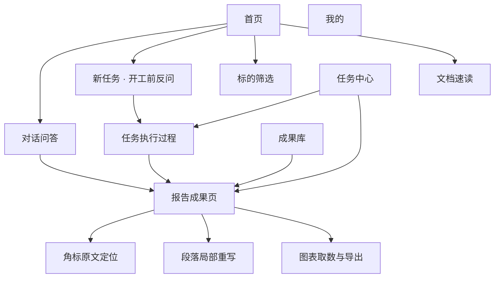

# 玑衡AI 产品需求文档（PRD）v3

2026-09-22 · @Lurnings

## 1. 文档信息

本 PRD 依据高保真原型 `JihengAI-v3_dc.html`（16 屏移动端原型，原型内自述版本 v2）反推整理，覆盖玑衡AI 移动端首个可交付版本的全部功能范围。

| 项目 | 内容 |
| --- | --- |
| 产品名称 | 玑衡AI（移动端 App） |
| 文档版本 | PRD v3.0 |
| 对应原型 | JihengAI-v3\_dc.html，16 屏 |
| 目标平台 | iOS / Android 原生或跨端，竖屏优先，图表页支持横屏 |
| 版本类型 | 机构版（原型账号：研究部席位） |
| 对标参考 | 万得 Wind Alice 的「一句话下任务 → Agent 拆解执行 → 可交付成果」结构，视觉为原创设计 |
| 阅读对象 | 产品、设计、前端、Agent/后端、数据、合规 |

原型中所有公司名称、财务数字、研报名称均为示意数据，本文档中的数值只用于说明字段与展示格式，不作为数据口径依据。

## 2. 产品概述

玑衡AI 是面向机构研究人员的 A 股投研 Agent：用户一句话下达任务，Agent 拆解需求、取数、交叉校验后输出可直接交付的分析成果（报告、对比表、筛选结果、文档摘要），每条结论可回溯到原文页码。产品口号：「把整理交给它，把判断留给自己」。

### 2.1 核心价值

1. **成果而非聊天记录**：输出带目录、图表、引用页码的可导出稿件，而不是一段对话文本。
2. **句子级溯源**：每个结论后跟角标，点击弹出原文片段并高亮对应数字，核对成本从「翻年报」降到一次点击。
3. **过程透明可控**：Agent 执行步骤公开，每步说明取了什么数、有什么冲突；用户可中途改需求、转后台、停止、重跑。
4. **口径先于结果**：需求含糊时先反问范围与时间跨度；筛选条件先由自然语言转成显式条件供用户核对。
5. **移动端效率**：语音边说边转写、截图问股、@ 引用标的、/ 调用技能，降低长任务的输入成本。

### 2.2 产品边界

- 数据来自持牌金融数据库与公开披露；行情为 15 分钟延时。
- 不提供买卖建议，不预测点位；所有页面常驻「仅供参考，不构成投资建议」声明。
- 识图解读只依据截图中可见信息作答。

### 2.3 业务目标（首版）

| 目标 | 度量 |
| --- | --- |
| 研究员将高频整理型工作迁移到 App | 周活研究员数、人均周任务数 |
| 成果被实际使用 | 报告导出率（Word/PPT）、成果库回访率 |
| 溯源建立信任 | 角标点击率、引用夹使用率 |
| 长任务可靠 | 任务成功率、重跑率、平均耗时 |

## 3. 用户画像与核心场景

首版单一目标用户：券商/资管研究部的行业与公司研究员，已认证机构席位，日常产出报告、对比表与筛选清单，对数据口径与引用准确性高度敏感。

### 3.1 用户画像

| 维度 | 描述 |
| --- | --- |
| 角色 | 机构研究员（原型示例：研究部 陈其琛） |
| 账号 | 机构版，席位已认证，已开通 6 项数据权限 |
| 高频任务 | 公司深度分析、行业逻辑拆解、标的筛选、年报/招股书/公告速读 |
| 痛点 | 取数与核对占用大量时间；AI 结论无法溯源不敢引用；长任务不能离开页面 |
| 使用环境 | 移动端碎片时间、通勤、会议间隙；常用语音与截图 |

### 3.2 核心场景

| 编号 | 场景 | 用户路径 | 对应原型屏 |
| --- | --- | --- | --- |
| S1 | 一句话出报告 | 首页输入 → 开工前反问口径 → 任务执行 → 报告成果 → 导出 Word/PPT | 01 / 09 / 03 / 04 |
| S2 | 基本面快问 | 输入问题 → 流式回答带角标与表格 → 点角标看原文 → 追问或转成报告 | 02 / 10 |
| S3 | 条件筛选 | 自然语言 → 显式条件 → 结果表 → 加入自选 / 生成对比 / 存为模板订阅 | 05 / 11 |
| S4 | 文档速读 | 上传 PDF → 三句摘要 / 关键指标 / 风险段落 → 就文档提问 | 06 |
| S5 | 成果精修 | 报告内选中段落 → 改写/缩短/补数据/换口径 → 对比后采用 | 12 |
| S6 | 语音与截图输入 | 长按语音边说边转写并识别实体；相册截图问股得到归因 | 13 / 14 |
| S7 | 异步任务管理 | 任务中心查看进行中/需处理/订阅 → 停止、确认缺口、重跑 | 11 |
| S8 | 首次使用 | 冷启动页看能力与边界 → 点示例句直接开始 | 16 |

## 4. 信息架构与页面结构

App 采用四个一级 Tab（首页、任务、成果库、我的），输入框是唯一主入口，所有成果页共享溯源角标、导出与追问三个常驻能力。

从首页可直接进入四条能力路径，任务与成果两个 Tab 分别承接「进行中」与「已完成」的状态；语音、截图问股为输入框上的两种输入模式，不单独占 Tab。

### 4.1 页面清单

| 原型屏 | 页面 | 层级 | 入口 |
| --- | --- | --- | --- |
| 16 | 首次使用（冷启动） | 独立 | 首次安装 / 未登录 |
| 01 | 首页 | Tab 1 | 底部导航 |
| 09 | 新任务 · 开工前反问 | 二级 | 首页输入含糊需求后 |
| 13 | 语音提问 | 浮层 | 输入框「语音」长按 |
| 14 | 截图问股 | 二级 | 输入框「截图问股」/ 附件 |
| 02 | 对话问答 | 二级 | 首页输入问题、成果库问答记录 |
| 03 | Agent 任务执行过程 | 二级 | 新任务开工、任务中心进行中 |
| 04 | 报告成果页 | 二级 | 任务完成、成果库、问答「转成报告」 |
| 10 | 角标原文定位 | 底部弹层 | 成果页/问答页任意角标 |
| 12 | 段落局部重写 | 成果页内态 | 长按选中段落 |
| 15 | 图表取数与导出 | 全屏/横屏 | 成果页图表点击 |
| 05 | 标的筛选 | 二级 | 首页技能卡「标的筛选」、自然语言筛选类需求 |
| 06 | 文档速读 | 二级 | 首页技能卡「文档速读」、附件上传 PDF |
| 11 | 任务中心 | Tab 2 | 底部导航、首页「进行中的任务」 |
| 07 | 成果库 | Tab 3 | 底部导航 |
| 08 | 我的 | Tab 4 | 底部导航 |

## 5. 功能需求详述

共 16 个功能模块，优先级 P0 为首版必须、P1 为首版应有、P2 为后续迭代。每个模块按原型屏号对应，交互规则以原型标注为准。

### 5.1 首页（屏 01）

| 编号 | 功能点 | 需求描述 | 优先级 |
| --- | --- | --- | --- |
| F1-1 | 问候区 | 按时段显示「上午好/下午好/晚上好，{姓氏}研究员」与引导语「今天想让我做点什么？」 | P1 |
| F1-2 | 主输入框 | 唯一主入口，占位文案「帮我分析一家公司、一个行业，或筛一批标的…」；底部工具条含 附件、深度模式、语音、发送 | P0 |
| F1-3 | 深度模式开关 | 开启后任务走多步 Agent 流程并消耗深度额度；关闭为普通问答，不限次 | P0 |
| F1-4 | 金融技能卡 | 横向 4 张高频卡（公司深度分析 / 行业逻辑拆解 / 标的筛选 / 文档速读），右上「全部 28 个」进技能列表；点击卡片仅将指令模板预填进输入框，不另开表单 | P0 |
| F1-5 | 进行中的任务 | 展示最近 1 条进行中任务：标题、进度百分比、进度条、当前动作与预计剩余时间；点击进入执行过程页 | P0 |
| F1-6 | 自选异动 | 展示自选池异动 Top N（名称、一句话异动原因、涨跌幅，涨红跌绿）；「全部 N 只」进自选列表；点击进入该标的问答 | P1 |
| F1-7 | 底部导航 | 首页 / 任务 / 成果库 / 我的 四 Tab，当前 Tab 高亮 | P0 |

### 5.2 新任务与开工前反问（屏 09）

| 编号 | 功能点 | 需求描述 | 优先级 |
| --- | --- | --- | --- |
| F2-1 | 需求含糊判定 | 深度任务提交后，Agent 判定范围/时间跨度等关键口径缺失时，先返回反问卡而非直接开工；反问项 ≤ 2 个 | P0 |
| F2-2 | 反问卡 | 每项以 Chip 单选（如 范围：全球 / 只看中国 / 含港股同业；时间跨度：近三年 / 近五年），选中后自动开工 | P0 |
| F2-3 | 跳过按默认口径 | 常驻「跳过，按默认口径直接开始」；默认口径需在任务第一步「拆解需求」中回显 | P0 |
| F2-4 | 额度显示 | 页头显示「额度 18/50」，深度任务开工前可见剩余额度 | P1 |
| F2-5 | @ 引用标的 | 输入 @ 触发标的联想（名称 + 代码），选中后以实体 Chip 形式插入输入框 | P0 |
| F2-6 | / 技能 | 输入 / 触发技能列表（28 项），选中后预填指令模板 | P1 |
| F2-7 | 截图问股入口 | 输入工具条含「截图问股」，进入屏 14 | P1 |
| F2-8 | 键盘联想 | 键盘候选栏给出金融术语联想（如 毛利率 / 毛利 / 毛利率结构），点选替换当前词 | P2 |

### 5.3 语音提问（屏 13）

| 编号 | 功能点 | 需求描述 | 优先级 |
| --- | --- | --- | --- |
| F3-1 | 长按录音 | 长按语音键进入全屏录音层，「松手结束 · 上滑取消」，顶部显示「正在听 · mm:ss」 | P0 |
| F3-2 | 实时转写 | 边说边流式显示转写文本，未定稿部分弱化显示 | P0 |
| F3-3 | 实体当场识别 | 转写中识别标的（名称 + 代码）与指标词，以 Chip 列出「已识别到」，可点击删除或更正 | P0 |
| F3-4 | 领域纠错 | 语音识别接金融词表纠正同音误识（示例：「影石」不识别为「影视」） | P1 |
| F3-5 | 发送前可编辑 | 松手后转写文本回填输入框可直接修改；提供「取消」「改用键盘」 | P0 |

### 5.4 截图问股（屏 14）

| 编号 | 功能点 | 需求描述 | 优先级 |
| --- | --- | --- | --- |
| F4-1 | 选图 | 从相册选取行情截图，支持「重新选图」 | P1 |
| F4-2 | 识别回读 | 先回读识别结果：标的（名称 + 代码）、周期（日线/周线）、区间（起止日期），用户确认理解无误后再看结论 | P1 |
| F4-3 | 区间归因 | 输出区间涨跌幅与放量分布，归因分条编号，每条带角标；板块贡献单列，避免归因给单一事件 | P1 |
| F4-4 | 声明 | 结果下方固定「识图结果仅依据截图中可见信息，不构成投资建议」 | P0 |
| F4-5 | 追问 | 提供追问建议 Chip（如 估值到什么位置了 / 同期同业怎么走）与自由追问输入 | P1 |

### 5.5 对话问答（屏 02）

| 编号 | 功能点 | 需求描述 | 优先级 |
| --- | --- | --- | --- |
| F5-1 | 会话页头 | 标题为「{标的} · {问答类型}」，右上「收藏」 | P1 |
| F5-2 | 流式输出 | 回答按 token 流式渲染；生成中可停止 | P0 |
| F5-3 | 数据源计数 | 回答卡顶部显示「引用 N 个数据源 · 可逐条核对」 | P0 |
| F5-4 | 结论角标 | 每个数据结论后跟上标数字角标，点击进入屏 10 | P0 |
| F5-5 | 结构化表格 | 时序/对比类数据直接以表格返回（列：主体 × 年份），非以文字罗列 | P0 |
| F5-6 | 来源列表 | 卡片底部固定「数据来源」列表：编号、文档名、页码或发布机构与日期 | P0 |
| F5-7 | 卡片操作 | 复制 / 导出 / 生成图表 / 转成报告；「转成报告」将本轮问答作为输入创建深度任务 | P0 |
| F5-8 | 追问建议 | 回答下方给 2 条追问 Chip，另有「继续追问…」输入框 | P1 |

### 5.6 Agent 任务执行过程（屏 03）

| 编号 | 功能点 | 需求描述 | 优先级 |
| --- | --- | --- | --- |
| F6-1 | 任务头 | 显示原始需求全文、「第 k 步，共 n 步 · 已读 N 份材料」、计时器；右上「后台运行」 | P0 |
| F6-2 | 步骤时间线 | 固定 5 步：拆解需求 → 检索与取数 → 交叉校验数据 → 生成对比表与图表 → 撰写结论与风险提示；状态 已完成 ✓ / 进行中 / 待执行 | P0 |
| F6-3 | 步骤说明 | 每步展开一句话说明：拆解需求回显口径；取数列出材料来源分类计数（研报 N / 年报 N / 宏观 N）；校验步骤列出数据冲突并标为「待你确认的口径」 | P0 |
| F6-4 | 已成稿片段 | 「边写边看」区实时展示已生成段落 | P1 |
| F6-5 | 中途干预 | 「转后台并通知我」「调整需求」两个操作；调整需求后从拆解步骤重跑，已取材料复用 | P0 |
| F6-6 | 冲突移交 | 数据冲突（如 3 家机构预测差异 >15%）不自动裁决，生成「需处理」项进入任务中心 | P0 |

### 5.7 报告成果页（屏 04）

| 编号 | 功能点 | 需求描述 | 优先级 |
| --- | --- | --- | --- |
| F7-1 | 页头 | 「目录」「导出」；标签「玑衡生成」与规格「N 页 · N 图 N 表」 | P0 |
| F7-2 | 报告元信息 | 标题、副标题、「{日期}生成 · N 处引用可回看原文」；正文页头显示「数据截至 {日期}」 | P0 |
| F7-3 | 目录 | 章节名 + 页码，点击跳转 | P0 |
| F7-4 | 正文渲染 | 章节标题、段落、结论角标、图表（含标题「图 N · …」与图例）、表格 | P0 |
| F7-5 | 图表可交互 | 点击图表进入屏 15 | P1 |
| F7-6 | 底部常驻栏 | Word / PPT / 分享 / 继续追问；Word、PPT 导出保留目录、图表与引用页码 | P0 |
| F7-7 | 段落编辑 | 长按段落进入屏 12 局部重写 | P1 |

### 5.8 角标原文定位（屏 10）

| 编号 | 功能点 | 需求描述 | 优先级 |
| --- | --- | --- | --- |
| F8-1 | 弹层触发 | 点击任意角标从底部弹出溯源层，页面背景保留上下文 | P0 |
| F8-2 | 引用元信息 | 「引用 N · {文档名}」「第 N 页 · 披露日 {日期}」 | P0 |
| F8-3 | 原文片段 | 展示原文句子级片段，高亮与结论对应的数字或短语 | P0 |
| F8-4 | 操作 | 看全文（跳转文档速读并定位页）/ 存到引用夹 / 就这段提问 | P0 |
| F8-5 | 关联引用 | 「本段还有 N 处相关引用」「查看全部 N 处」 | P1 |

### 5.9 段落局部重写（屏 12）

| 编号 | 功能点 | 需求描述 | 优先级 |
| --- | --- | --- | --- |
| F9-1 | 段落选中 | 长按报告段落进入选中态，浮出操作条：改写 / 缩短 / 补数据 / 换口径 | P1 |
| F9-2 | 局部生成 | 仅重写选中段，其余内容与引用编号保持不变；生成中显示「正在重写这一段」并可停止 | P1 |
| F9-3 | 新旧对比 | 新版本以高亮块显示在原段下方，原文始终保留可见 | P1 |
| F9-4 | 结果操作 | 保留原文 / 再来一版 / 采用；采用后更新报告并同步新增引用 | P1 |
| F9-5 | 补数据规则 | 「补数据」要求新增数字必须带角标，无法溯源的数字不写入 | P1 |

### 5.10 图表取数与导出（屏 15）

| 编号 | 功能点 | 需求描述 | 优先级 |
| --- | --- | --- | --- |
| F10-1 | 全屏查看 | 点击报告图表进入全屏，支持「横屏」 | P1 |
| F10-2 | 口径切换 | Tab：近三年 / 近五年 / 单季 / 占比，切换后重绘并与报告正文口径标注一致 | P1 |
| F10-3 | 长按取数 | 长按柱/点显示该期各系列数值与同比；左右拖动比较年份 | P1 |
| F10-4 | 数据截止说明 | 底部固定「数据截至 {日期}，口径与报告正文一致」 | P0 |
| F10-5 | 操作 | 导出本图（PNG）/ 看数据表 / 就这张图提问 | P1 |

### 5.11 标的筛选（屏 05）

| 编号 | 功能点 | 需求描述 | 优先级 |
| --- | --- | --- | --- |
| F11-1 | 需求回读 | 「你说的是」区回显原始自然语言 | P0 |
| F11-2 | 显式条件 | 自然语言先转成 N 个条件 Chip（字段 + 运算符 + 阈值，如 研发费用率 ≥ 8%），每个可删除；「+ 加条件」手动新增；条件变更即时重算 | P0 |
| F11-3 | 结果表 | 「命中 N 家」、排序下拉（默认按首个数值条件降序）；列：名称 / 关键指标 1 / 关键指标 2 / 涨跌；默认展示 7 行，「查看全部 N 家」展开 | P0 |
| F11-4 | 结果操作 | 加入自选（多选）/ 生成对比分析（创建深度任务） | P0 |
| F11-5 | 存为模板 | 右上「存为模板」保存条件集；模板可在任务中心设为定时重跑并推送 | P1 |

### 5.12 文档速读（屏 06）

| 编号 | 功能点 | 需求描述 | 优先级 |
| --- | --- | --- | --- |
| F12-1 | 上传解析 | 支持 PDF 年报、招股书、公告；显示「N 页 · 读完用了 N 秒」；右上「原文」切换到原文阅读 | P0 |
| F12-2 | 三层 Tab | 摘要 / 关键数据 / 风险段落 / 问文档 | P0 |
| F12-3 | 三句话摘要 | 摘要 ≤ 3 句，每个数字后跟页码角标（pN），点击跳原文 | P0 |
| F12-4 | 关键指标卡 | 抽取营业收入、归母净利、经营现金流、存货周转等指标以卡片展示 | P0 |
| F12-5 | 值得注意 | 风险与变化段落（如客户集中度上升、新增关税表述），带页码 | P1 |
| F12-6 | 常看段落跳转 | 快捷入口：管理层讨论与分析、分产品与分地区收入等，带页码 | P1 |
| F12-7 | 就文档提问 | 底部输入框，文档作为对话上下文，回答带页码角标 | P0 |

### 5.13 任务中心（屏 11）

| 编号 | 功能点 | 需求描述 | 优先级 |
| --- | --- | --- | --- |
| F13-1 | 分类 Tab | 全部 / 进行中 / 需处理 / 订阅，各带计数 | P0 |
| F13-2 | 进行中卡 | 标题、进度百分比、「第 k 步，共 n 步 · 约剩余时间」、「停止」 | P0 |
| F13-3 | 需处理卡 | 标签「需你确认」、缺口说明（缺哪项数据、影响哪张表哪一行）、两个决策按钮（如 用行业均值替代 / 留空并标注）；选择后任务续跑 | P0 |
| F13-4 | 失败卡 | 失败原因与时间（如 数据源超时中断 · 14:02）、「重跑」；重跑复用已取材料 | P0 |
| F13-5 | 订阅卡 | 定时任务（筛选模板、盘前简报）显示周期与推送规则，可编辑/取消 | P1 |
| F13-6 | 已完成卡 | 「已完成 {时间} · N 页 · N 处引用」、「查看成果」 | P0 |
| F13-7 | 后台运行 | 任务离开页面后继续执行，完成/需处理/失败三类状态触发推送（受「任务完成推送」开关控制） | P0 |

### 5.14 成果库（屏 07）

| 编号 | 功能点 | 需求描述 | 优先级 |
| --- | --- | --- | --- |
| F14-1 | 搜索 | 搜索会话、报告、文档标题与正文 | P1 |
| F14-2 | 类型筛选 | 全部 / 报告 / 筛选结果 / 收藏，另含文档、问答两类标签 | P0 |
| F14-3 | 时间分组 | 今天 / 本周 / 更早 | P0 |
| F14-4 | 成果卡 | 标题、类型标签、元信息（报告：N 页 · 引用 N 处；筛选：N 个条件 · 已加入自选 N 只 / 定时规则；文档：N 页；问答：N 轮对话；已导出标记）、时间 | P0 |
| F14-5 | 收藏 | 任意成果可收藏，进入收藏 Tab | P1 |

### 5.15 我的（屏 08）

| 编号 | 功能点 | 需求描述 | 优先级 |
| --- | --- | --- | --- |
| F15-1 | 账号头 | 头像、姓名、「机构版 · {部门} · 席位已认证」 | P0 |
| F15-2 | 额度卡 | 「本月深度任务额度 18 / 50」进度条，说明「日常问答不限次，额度每月 1 日重置」 | P0 |
| F15-3 | 输出偏好 | 默认输出语言（中文/英文）、报告模板（如 研究部标准版，机构可自定义） | P1 |
| F15-4 | 开关 | 数据溯源角标（关闭后导出稿不带角标，适配不同汇报口径）、任务完成推送 | P1 |
| F15-5 | 资产与权限 | 我的自选与组合；数据权限与席位（已开通 N 项） | P1 |
| F15-6 | 合规 | 合规与免责声明入口；页脚常驻「本应用提供的信息仅供参考，不构成投资建议」；退出登录 | P0 |

### 5.16 首次使用（屏 16）

| 编号 | 功能点 | 需求描述 | 优先级 |
| --- | --- | --- | --- |
| F16-1 | 价值主张 | 主标题「把整理交给它，把判断留给自己」与一句能力说明 | P0 |
| F16-2 | 三个示例 | 可直接点击的示例句（公司分析 / 行业格局 / 条件筛选），点击后预填并进入首页 | P0 |
| F16-3 | 边界声明 | 「先说清边界」卡：数据来源与持牌说明、行情 15 分钟延时、不提供买卖建议、不预测点位 | P0 |
| F16-4 | 开始 | 「开始第一个任务」；下方「继续即表示同意服务条款与隐私政策」并链接全文 | P0 |

## 6. 数据与 AI 能力需求

Agent 侧的硬约束只有一条：任何写入成果的数字必须能定位到一条带页码或发布信息的原文片段，做不到则不写。

### 6.1 数据源

| 数据类型 | 来源 | 时效 | 用途 |
| --- | --- | --- | --- |
| 公司披露 | 年报、招股书、公告（PDF 全文 + 页级索引） | 披露日 T+0 入库 | 溯源角标、文档速读、财务指标 |
| 卖方研报 | 持牌研报库，含机构、日期、页码 | T+1 | 行业分析、预测交叉校验 |
| 财务与估值 | 持牌金融数据库结构化数据 | 日更 | 筛选条件、对比表 |
| 行情 | 15 分钟延时行情 | 15 min | 自选异动、截图问股区间校核 |
| 宏观与海关 | 公开统计数据 | 月更 | 行业规模、出口数据 |
| 用户上传 | PDF 文档 | 即时 | 文档速读、就文档提问 |

### 6.2 Agent 能力

| 能力 | 需求 |
| --- | --- |
| 意图识别 | 区分 问答 / 深度任务 / 筛选 / 文档 四类；判定关键口径缺失并生成 ≤ 2 项反问 |
| 任务规划 | 固定 5 步骤模板，可估算材料数与剩余时间并实时更新 |
| 检索取数 | 多源检索并按 研报 / 年报 / 宏观 分类计数；页级引用抽取 |
| 交叉校验 | 同一指标多源差异超阈值（原型示例 15%）时标为冲突，不自动裁决，生成决策项交回用户 |
| 缺口处理 | 数据缺失时给出 ≥ 2 个可选处理方式（替代 / 留空标注），选择后续跑 |
| 结构化生成 | 表格、图表（分类堆叠、时序）与正文分离生成，图表附口径与数据截止日 |
| 局部重写 | 段落级 改写 / 缩短 / 补数据 / 换口径，不改动其他段落与引用编号 |
| 筛选翻译 | 自然语言 → 显式条件（字段、运算符、阈值），条件可逆向回读为文字 |
| 文档理解 | 218 页级 PDF 在 ≤ 2 分钟内完成摘要、指标抽取、风险段落定位 |
| 语音与视觉 | 金融词表纠错的 ASR；行情截图识别标的、周期、区间 |

### 6.3 输出规范

- 结论句式：先结论后依据，数字后紧跟角标；同一段落引用编号连续。
- 表格：首列为主体，后列为时间或指标；百分数保留 1 位小数；涨跌用 +/− 符号。
- 报告结构：核心结论 → 业务/结构拆解 → 行业位置与同业对比 → 风险与观察指标；页头标注数据截止日。
- 归因类输出（截图问股）分条编号，板块贡献必须单列。
- 禁止输出：买卖建议、目标价、点位预测；无法溯源的具体数字。

## 7. 非功能需求

| 类别 | 需求 | 指标 |
| --- | --- | --- |
| 性能 | 问答首 token 延迟 | ≤ 2 s |
| 性能 | 深度任务总时长（5 步、约 30–50 份材料） | ≤ 5 min，进度每 ≤ 5 s 刷新 |
| 性能 | PDF 速读（≤ 300 页） | ≤ 2 min |
| 性能 | 语音转写延迟 | 端到端 ≤ 500 ms |
| 可靠性 | 长任务后台执行 | App 退到后台或杀进程后任务不中断，状态可恢复 |
| 可靠性 | 失败重跑 | 数据源超时等可重试错误支持一键重跑，复用已取材料 |
| 合规 | 免责声明 | 冷启动、我的页脚、识图结果、报告导出稿均含「不构成投资建议」 |
| 合规 | 数据许可 | 研报与数据库仅对已开通权限的席位可见，无权限时提示开通而非降级展示 |
| 合规 | 行情延时 | 所有行情数据标注 15 分钟延时 |
| 安全 | 用户上传文档 | 仅账号本人可见，支持删除；不用于模型训练 |
| 安全 | 导出稿 | 导出记录留痕（时间、格式、成果 ID） |
| 兼容 | 设备 | iOS 16+ / Android 10+，375 pt 宽度基线，图表页支持横屏 |
| 兼容 | 导出格式 | Word（.docx）、PPT（.pptx）、单图 PNG、数据表 |
| 可用性 | 溯源开关 | 关闭角标后正文与导出稿同步隐藏角标，来源列表仍保留于附录 |

## 8. 埋点与指标

北极星指标为「周人均可交付成果数」（报告导出 + 筛选结果加入自选 + 文档速读完成），其余指标围绕信任与可靠性。

| 事件 | 触发点 | 关键属性 | 服务指标 |
| --- | --- | --- | --- |
| task\_submit | 输入框发送 | 类型、深度模式、输入方式（键盘/语音/截图/技能卡/@ / 示例句） | 输入方式分布 |
| clarify\_answer | 反问卡选择或跳过 | 反问项、选项、是否跳过 | 反问采纳率 |
| task\_step | 每步状态变更 | 步骤序号、耗时、材料数 | 各步耗时分布 |
| task\_intervene | 转后台 / 调整需求 / 停止 | 动作、所在步骤 | 中途干预率 |
| task\_conflict | 生成需处理项 | 冲突类型、用户选择、等待时长 | 缺口处理时长 |
| task\_end | 完成 / 失败 / 重跑 | 结果、失败原因、是否重跑 | 任务成功率、重跑率 |
| cite\_open | 点击角标 | 引用编号、来源类型、后续动作（看全文/存引用夹/提问） | 角标点击率 |
| result\_export | Word / PPT / 单图 / 复制 | 格式、页数、是否关闭角标 | 导出率 |
| paragraph\_edit | 局部重写 | 动作、是否采用、再来一版次数 | 采用率 |
| screen\_filter | 条件变更 | 条件数、命中数、排序字段 | 条件修改率 |
| screen\_action | 加入自选 / 生成对比 / 存模板 | 动作、选中数 | 筛选转化率 |
| doc\_read | 文档解析完成 | 页数、耗时、Tab 切换、提问数 | 速读完成率 |
| quota\_view | 额度卡曝光 | 已用/总额 | 额度耗尽率 |

## 9. 范围外事项、待确认问题与后续迭代

首版明确不做交易、不做个股推荐、不做实时行情；以下问题需在开发前由产品与业务确认。

### 9.1 范围外

- 交易下单、持仓同步、组合回测。
- 实时 Level-1/Level-2 行情与盘中预警。
- 多人协作编辑与评论、机构内共享空间。
- 港美股全量覆盖（首版仅在「含港股同业」口径下引入港股对比数据）。
- 用户自定义 Agent 技能编排。

### 9.2 待确认问题

- [ ] 目标用户定位：原型为机构版（研究部席位、额度制），与此前「面向个人投资者、投资教育」定位是否并行两条产品线，还是首版收敛为机构版？
- [ ] 深度任务额度：50 次/月为席位默认还是套餐可配？日常问答「不限次」是否需要防滥用上限？
- [ ] 28 项金融技能的完整清单与各技能的指令模板归属（产品维护 vs 机构自定义）。
- [ ] 报告模板「研究部标准版」的字段规范、机构自定义模板的配置方式与审核流程。
- [ ] 冲突阈值（原型示例 15%）是否按指标类型分别设定；缺口处理默认选项是否可由机构预设。
- [ ] 关闭溯源角标后导出稿的来源附录是否保留，需合规确认。
- [ ] 用户上传文档的存储期限、跨设备同步与删除策略。
- [ ] 订阅任务（每周一 08:30 重跑、交易日 08:00 盘前简报）的推送通道：App 推送、企业微信或邮件。
- [ ] 语音与识图能力的供应商选择及金融词表维护方。
- [ ] 原型自述为 v2 而文件名为 v3，需确认版本命名与设计稿基线。

### 9.3 后续迭代方向

| 方向 | 说明 | 建议版本 |
| --- | --- | --- |
| 键盘金融术语联想 | 原型屏 09 已示意，依赖输入法能力 | v3.1 |
| 引用夹 | 跨报告收集原文片段，导出为附录 | v3.1 |
| 自选池盘前简报增强 | 异动归因扩展至组合层面 | v3.2 |
| 桌面端 / 网页端 | 复用成果库与任务中心，承接长报告编辑 | v4 |
| 机构共享空间 | 团队内成果共享、模板分发、权限管理 | v4 |
