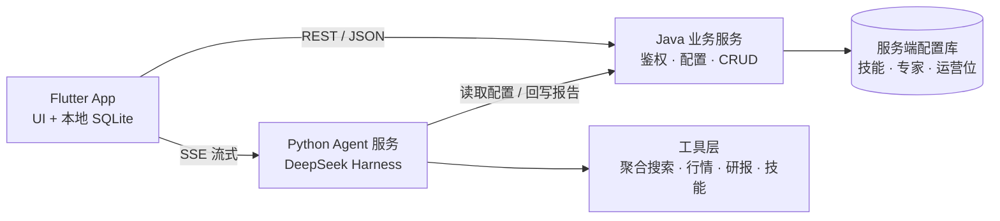

# 玑衡AI 产品实施计划

2026-09-22 · @Lurnings

本文档对应《[玑衡AI 产品需求文档](玑衡AI%20产品需求文档.md)》（PRD），给出该版本 PRD 的技术实施方案。章节编号与 PRD 独立编排；文中出现的 `F-XXX`、`8.x` 等编号均指向 PRD 对应章节。

实施按 P0 → P1 → P2 分四个迭代推进，技术栈为 Flutter 移动端、Java 业务 CRUD 服务、Python + DeepSeek Harness（dsh）Agent 服务，用户数据先落客户端 SQLite。

## 1. 技术架构总览

三端分离：Flutter 负责全部 UI 与本地数据；Java 服务承担鉴权、配置下发与普通 CRUD；Python Agent 服务承担对话推理、工具 / 技能调用与流式输出。Agent 流式链路由 Flutter 直连 Python（SSE），避免经 Java 二次转发引入延迟；Java 签发的 JWT 在两侧服务统一校验。

| 端 | 职责 | 对应需求 |
| --- | --- | --- |
| Flutter App | 全部页面、渐进渲染、本地会话 / 消息 / 报告 / 技能开关存储、埋点上报 | PRD 第 5、6、7 节全部 |
| Java 业务服务 | 登录鉴权与 JWT 签发、用户资料与统计、技能库与专家配置下发、技能开关同步、报告归档与导出、定时 / 提醒任务 CRUD、通知记录 | F-DRW、F-RPT、F-SKL、F-PRF、F-AUT、F-NTF |
| Python Agent 服务 | 三模式路由（快速 / 深度 / 专家）、dsh 推理循环、工具与技能编排、阶段事件流式输出、风险提示与溯源强制校验、trace 记录 | F-HOME-07～12、F-EXP-05、PRD 8.3 输出约束 |
| 工具层 | 聚合搜索、行情、研报 / 公告、新闻等数据源适配器，统一为 dsh 可调用工具 | PRD 8.2 数据来源 |

## 2. 存储策略

第一阶段用户私有数据全部落客户端 SQLite，服务端仅保存公共配置与必须跨端的报告归档；表结构按 PRD 第 8.1 节数据模型建，并从第一天起预留 `server_id`、`synced_at`、`deleted_at` 字段，为后续迁服务端做准备。

| 数据 | 第一阶段落点 | 迁移目标 | 说明 |
| --- | --- | --- | --- |
| Conversation / Message / AIAnswer / Reference | 客户端 SQLite（drift） | 服务端 PostgreSQL | 离线可读；迁移时按 `synced_at` 增量上传 |
| Skill 开关状态、自建技能 | 客户端 SQLite，开关变更异步上报 Java | 服务端 | 官方技能元数据由 Java 下发并本地缓存 |
| Report | 客户端 SQLite + Java 归档副本 | 服务端 | 导出与晨报发送依赖服务端副本 |
| Expert、官方 Skill 目录、运营配置 | Java 侧嵌入式 SQLite（JDBC） | PostgreSQL | 只读配置，随版本发布，Flyway 管理迁移脚本 |
| UserProfile、统计 | Java 侧 SQLite | PostgreSQL | 统计由 Java 聚合客户端上报事件 |
| ScheduledTask / ReminderTask / Notification | Java 侧 SQLite | PostgreSQL | 任务须服务端调度，不能只存客户端 |

迁移路径：SQLite（客户端 + 服务端嵌入式）→ 增加同步接口（`/sync/push`、`/sync/pull`）→ 服务端切 PostgreSQL → 客户端 SQLite 降级为缓存层。数据访问在 Flutter 侧统一走 Repository 接口，切换数据源不改 UI 层。

## 3. 按优先级排列的实施清单

P0 是对话闭环与三端骨架，缺一不可上线；P1 补齐能力面与框架页；P2 为 v1.1 自动化能力。清单内按依赖顺序排列，前置项完成后后续项可并行。

**P0 — 对话闭环（必须）**

| 序号 | 工作项 | 端 | 依赖 | 对应需求 |
| --- | --- | --- | --- | --- |
| 1 | 三端工程骨架：Flutter 项目（go\_router + Riverpod + drift）、Java Spring Boot 服务、Python FastAPI + dsh 服务；统一 CI、环境配置、日志规范 | 全端 | — | — |
| 2 | 接口契约冻结：Agent 阶段事件 Schema（stage / tool / intro / sections / risk / refs）、Java REST 接口、错误码 | 全端 | 1 | PRD 6.1、8.1 |
| 3 | 鉴权：手机号登录、JWT 签发与两侧校验、Flutter 端 Token 存储与刷新 | Java + Flutter + Python | 1 | F-PRF-01 |
| 4 | 本地 SQLite 数据层：drift 表结构（PRD 第 8.1 节全部实体）、Repository 接口、迁移脚本 | Flutter | 2 | PRD 8.1 |
| 5 | dsh Agent 基座：快速问答模式推理循环、聚合搜索工具接入、SSE 流式输出、阶段事件切分 | Python | 2 | F-HOME-07、08 |
| 6 | 输出守卫：风险提示强制追加与结尾校验、refs 为空拒答回退、机构观点来源标注、禁词校验 | Python | 5 | F-HOME-10、PRD 8.3 |
| 7 | 首页与对话 UI：顶栏、欢迎语、金融专家卡片、模式 Chip、输入区、消息气泡、渐进渲染、自动滚动 | Flutter | 4、5 | F-HOME-01～09、14、15 |
| 8 | 溯源折叠、AI 声明、复制 / 分享 | Flutter | 7 | F-HOME-11～13 |
| 9 | 专家配置下发接口 + Python 侧专家路由（6 套系统提示与工具集） | Java + Python | 2、5 | F-EXP-03、05 |
| 10 | 专家弹层、卡片选中联动、Placeholder 切换 | Flutter | 7、9 | F-EXP-01～04 |
| 11 | 深度研究模式：多轮检索 + 推理、后台执行、完成后回写报告 | Python + Java | 5、6 | PRD 2.4 目标 1 |
| 12 | 侧边抽屉：导航项、历史对话分组与恢复、账号卡 | Flutter | 4 | F-DRW-01～05 |
| 13 | 官方技能目录下发（36 个）+ dsh 技能调用（技能作为可插拔工具包）+ 「已调用技能」事件 | Java + Python | 5 | F-SKL-08、F-HOME-08 |
| 14 | 技能广场 UI：三 Tab、开关（本地持久化 + 异步上报）、计数、空态 | Flutter + Java | 4、13 | F-SKL-01、03～05、07 |
| 15 | 报告归档接口与报告库 UI：Tab 筛选、时间分组、状态色、查看页 | Java + Flutter | 4、11 | F-RPT-01～05 |
| 16 | 埋点 SDK 接入与 PRD 第 8.4 节事件全量上报 | Flutter + Java | 7 | PRD 8.4 |

**P1 — 能力面与框架页（应有）**

| 序号 | 工作项 | 端 | 依赖 | 对应需求 |
| --- | --- | --- | --- | --- |
| 17 | 报告导出：服务端 PDF / Word 渲染 + 系统分享 | Java + Flutter | 15 | F-RPT-06 |
| 18 | 个人中心：统计聚合、6 项设置、编辑资料、退出登录 | Java + Flutter | 3 | F-PRF-01～04 |
| 19 | 定时与提醒页：两分区、空态、任务 CRUD 接口（无创建表单） | Java + Flutter | 3 | F-AUT-01、02 |
| 20 | 通知中心：任务记录列表、空态、未读标记 | Java + Flutter | 19 | F-NTF-01、02 |
| 21 | 收藏 ♡ 落地（待 PRD 11.3 确认目标位置） | Flutter + Java | 8 | F-HOME-13 |
| 22 | 专家搜索、技能搜索、历史对话搜索 | Flutter | 10、14、12 | F-EXP-02、F-SKL-02、F-DRW-03 |
| 23 | 新建技能入口（跳转占位页） | Flutter | 14 | F-SKL-06 |
| 24 | 弱网 / 断线续传、失败重试、异常边界处理 | Flutter + Python | 7 | PRD 6.9 |
| 25 | Agent trace 记录与回放、性能压测（P95 ≤ 15s） | Python | 5 | PRD 第 9 节 |

**P2 — v1.1 自动化（可延后）**

| 序号 | 工作项 | 端 | 依赖 | 对应需求 |
| --- | --- | --- | --- | --- |
| 26 | 新建技能编辑器（提示框架 + 工具选择 + 试运行） | Flutter + Java + Python | 23 | F-SKL-06 |
| 27 | 定时任务创建表单 + 服务端调度器（晨报自动生成与发送） | Java + Python | 19 | F-AUT-01 |
| 28 | 对话意图识别创建提醒任务 + 条件监听触发 | Python + Java | 19 | F-AUT-03 |
| 29 | 系统推送打通、通知深链跳转 | Flutter + Java | 20 | F-NTF-03 |
| 30 | 数据同步接口与服务端 PostgreSQL 迁移 | Java + Flutter | 4 | 本文档第 2 节 |
| 31 | 输入区「＋」附件上传（PDF / 图片解析） | 全端 | 5 | F-HOME-05 |

## 4. 迭代排期

按两周一个 Sprint，5 个 Sprint（约 10 周）交付 v1.0；Sprint 0 为契约与骨架，Sprint 1–2 完成 P0，Sprint 3 完成 P1，Sprint 4 收口发布。P2 进入 v1.1 排期。

| Sprint | 周次 | 目标 | 交付物 | 覆盖工作项 |
| --- | --- | --- | --- | --- |
| Sprint 0 | 第 1–2 周 | 三端骨架可联调，契约冻结 | 空壳 App 可登录并收到一条 SSE 事件流 | 1、2、3、4 |
| Sprint 1 | 第 3–4 周 | 快速问答端到端跑通 | 输入问题 → 流式结构化回答 → 溯源 → 风险提示 | 5、6、7、8、16 |
| Sprint 2 | 第 5–6 周 | 三模式 + 专家 + 技能 + 报告闭环（Alpha） | 专家卡片与弹层、深度研究后台执行、技能开关、报告库 | 9～15 |
| Sprint 3 | 第 7–8 周 | P1 能力面（Beta） | 导出、个人中心、定时 / 提醒与通知框架页、搜索、弱网处理 | 17～24 |
| Sprint 4 | 第 9–10 周 | 稳定性与发布（RC → v1.0） | 压测、合规抽检 100 条、Bug 收敛、商店上架 | 25 + PRD 10.2 节验收 |

每个 Sprint 结束按 PRD 第 10.2 节验收标准做一次演示验收；Sprint 2 结束前必须完成 PRD 11.3 中影响架构的待确认项（产品面向对象、收藏落点、历史对话恢复）。

## 5. 关键技术方案

**Flutter 移动端**

- 状态管理 Riverpod，路由 go\_router（首页为根路由，二级页 push 替换内容区），本地库 drift（SQLite）并封装 Repository 层。
- 网络：dio 走 Java REST；SSE 用独立客户端解析 `text/event-stream`，按事件类型分发到消息状态机（stage 0 → 3）。
- 渐进渲染：AIAnswer 以不可变模型 + `copyWith` 逐字段更新，列表用 `ListView` + `AutoScroll`；Section / KV 表 / 溯源折叠拆为独立 Widget。
- 主题：PRD 第 7.1 节色彩令牌落为 `ThemeExtension`，标题 Noto Serif SC、正文 PingFang SC 系统回退。
- 埋点：统一 `Analytics.track(event, props)`，本地队列批量上报。

**Java 业务服务**

- Spring Boot 3 + JDK 21，MyBatis-Plus，SQLite JDBC 起步，Flyway 管理迁移脚本，切 PostgreSQL 时仅替换数据源与方言。
- 模块：`auth`（手机号验证码、JWT）、`profile`、`skill`（目录 + 用户开关）、`expert`（配置下发）、`report`（归档 + 导出）、`task`（定时 / 提醒 CRUD）、`notify`。
- 导出：报告 Markdown → HTML → PDF（Playwright 或 wkhtmltopdf），Word 用 docx4j；导出为异步任务，完成后写通知。
- 对外提供内网接口供 Python 读取专家 / 技能配置与回写报告，使用服务间 Token。

**Python Agent 服务**

- FastAPI 承载 `/chat/stream`（SSE），请求体含 `mode`、`expert`、`conversation_id`、`messages[]`；响应事件类型：`stage`、`tool_call`、`tool_result`、`intro`、`section`、`table`、`risk`、`refs`、`done`、`error`。
- DeepSeek Harness：一个 Harness 实例对应一个模式或专家，注入系统提示、工具集与输出模板；技能封装为独立工具包按需挂载，调用时发出 `tool_call{type:'skill'}` 事件。
- 工具层统一适配器接口（`name`、`schema`、`run`），聚合搜索、行情、研报各自实现；所有工具结果带 `source` 元数据以生成 refs。
- 输出守卫作为 Harness 后置钩子：校验 risk 结尾句、refs 非空、禁词表；不通过则重生成一次，仍失败回退通用回复。
- 深度研究以任务队列（Redis / 内存队列起步）后台执行，完成后调用 Java 报告归档接口。
- 每次调用记录 trace（模型输入输出、工具调用、耗时）到本地文件 / SQLite，供回放与归因。

**接口契约要点**

| 接口 | 方向 | 说明 |
| --- | --- | --- |
| `POST /auth/login`、`/auth/refresh` | Flutter → Java | 手机号登录、Token 刷新 |
| `GET /config/experts`、`/config/skills` | Flutter → Java | 专家与官方技能目录，带版本号供本地缓存 |
| `PUT /skills/{id}/enabled` | Flutter → Java | 开关同步 |
| `POST /chat/stream` | Flutter → Python | SSE 流式对话 |
| `POST /reports`、`GET /reports`、`POST /reports/{id}/export` | Flutter / Python → Java | 归档、列表、导出 |
| `GET /tasks`、`GET /notifications` | Flutter → Java | 定时 / 提醒任务与通知列表 |
| `POST /events` | Flutter → Java | 埋点批量上报 |

## 6. 团队分工与实施风险

最小团队 5 人：Flutter 2、Java 1、Python Agent 1、产品 / 测试 1；Sprint 0 由三端各出一人共同冻结契约。

| 角色 | 主责 | 关键交付 |
| --- | --- | --- |
| Flutter 工程师 A | 首页 / 对话 / 专家 / 渐进渲染 | 工作项 7、8、10、24 |
| Flutter 工程师 B | 数据层 / 抽屉 / 技能 / 报告 / 个人中心 | 工作项 4、12、14、15、18 |
| Java 工程师 | 鉴权 / 配置 / 报告 / 任务 / 导出 | 工作项 3、9、13、15、17、19、20 |
| Python Agent 工程师 | dsh 基座 / 工具 / 守卫 / 深度研究 | 工作项 5、6、9、11、13、25 |
| 产品 / 测试 | 契约评审、验收、合规抽检、待确认项闭环 | PRD 第 10.2、11.3 节 |

| 实施风险 | 缓解 |
| --- | --- |
| SSE 在弱网与后台切换时断连 | 客户端按 `last_event_id` 续传；服务端事件幂等；断线后保留已渲染内容 |
| dsh 与自研工具协议不匹配 | Sprint 0 先做一个搜索工具的端到端 spike，确认工具注册与流式事件切分方式 |
| 本地 SQLite 与后续服务端模型漂移 | 表结构与 Java 实体共用同一份 Schema 文档；同步字段第一天预留 |
| Java 侧 SQLite 并发写入瓶颈 | 仅存低频配置与归档；用户量上升前切 PostgreSQL（工作项 30） |
| 合规守卫误杀导致空回复 | 守卫失败先重生成再回退；回退率作为核心监控指标 |
| 三端并行导致契约反复变更 | 契约版本化（`v1` 前缀），变更需三端签字，Sprint 内不破坏兼容 |
