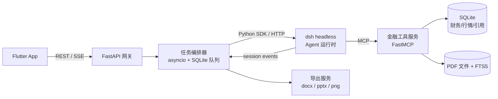
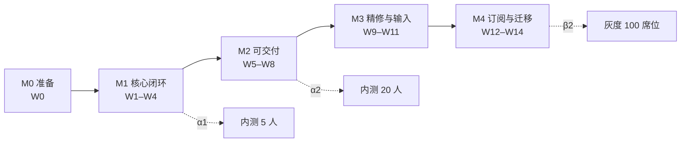
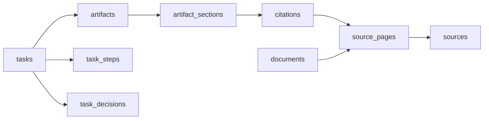
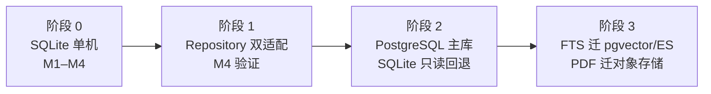

# 玑衡AI 移动端实施计划 v1

2026-09-22 · @Lurnings

## 1. 总体策略与技术栈

首版按 PRD 的 P0 → P1 → P2 优先级分四个里程碑、约 14 周交付：先打通「输入 → Agent 执行 → 带角标成果」的核心闭环，再补可交付能力，最后做输入增强与订阅。所有数据存本地 SQLite，但数据访问层从第一天起隔离，为服务端迁移留口。

| 层 | 选型 | 关键约束 |
| --- | --- | --- |
| 移动端 | Flutter 3.x（Dart），iOS 16+ / Android 10+ | 状态管理 Riverpod；路由 go\_router；SSE 客户端自研或 `flutter_client_sse`；图表 fl\_chart；本地缓存 drift（SQLite） |
| 后端 | Python 3.12，FastAPI + Uvicorn，SQLAlchemy 2.x + SQLite（WAL 模式） | 单进程可跑；任务队列用 asyncio + SQLite 任务表，不引入 Redis/Celery |
| Agent 运行时 | [DeepSeek Harness（dsh）](https://github.com/deepseek-ai/deepseek-harness) headless profile，作为 Python 服务的 sidecar 进程 | dsh 是 TypeScript/Node 运行时，Python 侧通过其 Python SDK / 本地 HTTP 驱动会话，金融工具以 Python MCP Server 挂给 dsh；dsh 仍处 developer preview，**版本必须锁定**，升级走独立分支 |
| 模型 | DeepSeek V4-Pro（规划、撰写）+ V4-Flash（意图识别、条件翻译、摘要） | 通过 dsh 的 LLM adapter 配置，Python 侧不直连模型 API，便于后续换模型 |
| 数据 | 结构化财务/行情：SQLite 表；PDF 全文：本地文件 + SQLite FTS5 页级索引 | 引用（citation）为一等实体，任何数字落库前必须关联 `citations` 行 |
| 导出 | python-docx、python-pptx、matplotlib（PNG） | 模板化，报告模板存 SQLite `report_templates` |

### 1.1 为什么这样切分

- Agent 循环、会话日志、工具调用管道交给 dsh：其 session log 为 append-only 事件流，天然对应 PRD 屏 03 的「执行过程公开可见」与屏 11 的中断重跑（[架构说明](https://github.com/deepseek-ai/deepseek-harness/blob/master/docs/architecture.md)）。
- 业务逻辑与数据全部留在 Python：取数、交叉校验、引用抽取、导出都是确定性代码，不依赖模型，也不受 dsh 破坏性升级影响。
- Flutter 只消费 SSE 事件与 REST，不感知 Agent 内部结构；后续换 Agent 框架端侧零改动。

### 1.2 优先级原则

1. P0 = PRD 中标 P0 的 16 个模块中的必需路径，M1–M2 交付，无一可砍。
2. P1 按「对信任的贡献 → 对输入效率的贡献」排序：局部重写与图表取数先于语音与截图。
3. P2（键盘联想、引用夹、桌面端）不进本计划排期，仅预留接口。
4. 每个里程碑末必须有可安装的内测包与一份端到端演示脚本。

## 2. 系统架构

四层：Flutter 端 → FastAPI 网关与任务编排 → dsh Agent 运行时（sidecar）→ Python MCP 金融工具与 SQLite。Agent 只能通过 MCP 工具触碰数据，所有工具返回值自带引用元数据。

dsh 的 session 事件流经编排器转成产品事件（步骤、进度、冲突、成稿片段）后由 SSE 推给端；端不直接连 dsh。

### 2.1 模块划分

| 模块 | 所属 | 职责 | 对应 PRD |
| --- | --- | --- | --- |
| `app/` Flutter | 端 | 16 屏 UI、SSE 消费、本地缓存（成果、任务状态）、导出文件打开与分享 | 全部 |
| `gateway/` | 后端 | 鉴权、REST、SSE 广播、额度校验、埋点接收 | F2-4、F15-2、第 8 章 |
| `orchestrator/` | 后端 | 任务状态机（排队/运行/需处理/失败/完成）、5 步模板、dsh 会话生命周期、后台运行与推送 | F6、F13 |
| `agent/` | Agent | dsh profile 与 patch：LLM adapter、prompt sections、工具白名单、反问/冲突策略 | F2-1、F6-6、6.2 |
| `tools/` FastMCP | Agent | `search_reports`、`get_financials`、`read_pdf_page`、`screen_stocks`、`cross_check`、`render_chart` 等 | 6.1、6.2 |
| `citation/` | 后端 | 引用登记、原文片段切取、数字高亮定位、角标编号 | F5-4、F8、F12-3 |
| `export/` | 后端 | Word/PPT/PNG 生成，模板渲染，溯源开关 | F7-6、F10-5、F15-4 |
| `data/` | 数据 | SQLite schema、迁移（Alembic）、示例数据导入、PDF 入库与分页索引 | 6.1、第 8 章 |

### 2.2 关键设计决策

- **引用先于文本**：工具返回 `{value, citation_id}`；撰写工具（`write_section`）校验正文中每个数字都能匹配一个 `citation_id`，否则拒绝写入并回给模型修正。
- **任务可恢复**：编排器只持久化任务状态与 dsh session id；进程重启后从 dsh session log 恢复步骤，不重跑已完成工具调用。
- **冲突不自动裁决**：`cross_check` 工具发现差异超阈值时返回 `conflict` 结构，编排器把任务置为「需处理」并暂停该 dsh 会话，用户选择后以 `agent.inject()` 注入决定继续。
- **端侧只读缓存**：Flutter 用 drift 缓存成果与任务列表用于离线浏览，写操作全部走后端，避免双写。
- **dsh 隔离**：所有 dsh 依赖限定在 `agent/` 与 `orchestrator/adapters/dsh.py`；定义 `AgentRuntime` 抽象接口，保留换框架的可能。

## 3. 里程碑与排期

四个里程碑共 14 周，M1–M2 覆盖全部 P0，M3 覆盖高价值 P1，M4 收尾 P1 并为服务端迁移铺路。排期按 移动端 2 人、后端/Agent 2 人、数据 1 人 估算；人力变化按比例伸缩，里程碑顺序不变。

| 里程碑 | 周次 | 目标 | 覆盖 PRD 模块 | 交付物 |
| --- | --- | --- | --- | --- |
| M0 准备 | W0 | 环境、脚手架、dsh 版本锁定、示例数据 | — | 可跑的空壳端与 `/health`；dsh headless 跑通一次工具调用 |
| M1 核心闭环 | W1–W4 | 一句话 → 反问 → 5 步执行 → 带角标问答/成果 → 任务中心 | 5.1 首页、5.2 反问（F2-1\~F2-3）、5.5 问答、5.6 执行过程、5.8 角标、5.13 任务中心（F13-1\~F13-4、F13-6\~F13-7）、5.16 冷启动 | 内测包 α1：能完成一份公司分析并核对引用 |
| M2 可交付 | W5–W8 | 报告成果页、导出、筛选、文档速读、成果库、我的 | 5.7 报告页、5.11 筛选（F11-1\~F11-4）、5.12 文档速读、5.14 成果库、5.15 我的、非功能 7 章 P0 项 | 内测包 α2：报告可导出 Word/PPT，PDF 可速读 |
| M3 精修与输入 | W9–W11 | 局部重写、图表取数、@ 引用、语音、截图问股 | 5.9、5.10、F2-5\~F2-7、5.3、5.4 | 内测包 β1：全部 P1 交互可用 |
| M4 订阅与迁移准备 | W12–W14 | 定时任务、存为模板、报告模板配置、性能达标、存储抽象验证 | F11-5、F13-5、F15-3\~F15-5、第 8 章埋点、第 11 章迁移 | β2 灰度包 + 迁移方案评审 |

每个里程碑的最后一周为集成与验收周，不排新功能；M2 与 M3 之间预留 3 天缓冲吸收 dsh 或数据源变更。

## 4. M0 + M1：核心闭环（W0–W4）

M1 结束时用户能在真机上说一句话、回答反问、看着 5 步执行、拿到带角标的答案并点角标看到原文——这是产品信任的最小证明。

### 4.1 M0 准备（W0）

| 任务 | 负责 | 工作量 | 验收 |
| --- | --- | --- | --- |
| Flutter 脚手架：Riverpod、go\_router、主题（纸感暖灰底、细线图标）、四 Tab 壳 | 端 | 2 人日 | 四 Tab 可切换，主题 Token 与原型一致 |
| FastAPI 脚手架：`/health`、鉴权占位、SSE 基础通道、Alembic | 后端 | 2 人日 | curl 可订阅 SSE 心跳 |
| dsh 锁版本：固定 npm tag，headless profile 跑通「调用一个 Python MCP 工具」 | Agent | 3 人日 | 一条 `dsh --profile headless` 命令完成工具往返，写入 ADR |
| `AgentRuntime` 接口与 dsh adapter 骨架 | Agent | 2 人日 | 接口含 `start / inject / stop / resume / events()` |
| 示例数据：3 家公司近 3 年财务、10 篇研报元数据、2 份年报 PDF 分页入库 | 数据 | 3 人日 | SQLite 文件 < 50 MB，FTS5 可按页检索 |

### 4.2 M1 移动端（W1–W4）

| 任务 | 对应 | 工作量 | 依赖 |
| --- | --- | --- | --- |
| 首页：问候、主输入框、深度模式开关、技能卡预填、进行中任务卡 | F1-1\~F1-5、F1-7 | 5 人日 | 后端 `/skills`、`/tasks?status=running` |
| 反问卡：Chip 单选、跳过默认口径、额度显示 | F2-1\~F2-4 | 3 人日 | SSE `clarify` 事件 |
| 问答页：流式 Markdown 渲染、角标组件、表格渲染、来源列表、操作条（复制/转成报告） | F5-1\~F5-7 | 6 人日 | SSE `chunk`/`citation`/`table` 事件 |
| 执行过程页：任务头、5 步时间线、步骤说明、材料计数、成稿片段、转后台/调整需求 | F6-1\~F6-5 | 6 人日 | SSE `step`/`progress`/`draft` 事件 |
| 角标溯源弹层：元信息、片段高亮、看全文/存引用夹(占位)/就这段提问 | F8-1\~F8-4 | 4 人日 | `/citations/{id}` |
| 任务中心：四 Tab、进行中/需处理/失败/已完成卡、停止、决策按钮、重跑 | F13-1\~F13-4、F13-6 | 5 人日 | `/tasks`、`/tasks/{id}/decide`、`/tasks/{id}/rerun` |
| 冷启动页：价值主张、三示例、边界声明、条款链接 | F16 | 2 人日 | 无 |
| SSE 客户端：断线重连、事件去重、后台恢复拉取 | 7 章可靠性 | 3 人日 | 后端 `Last-Event-ID` 支持 |

### 4.3 M1 后端与 Agent（W1–W4）

| 任务 | 对应 | 工作量 | 说明 |
| --- | --- | --- | --- |
| 任务状态机与 SQLite 队列：queued → clarifying → running → needs\_decision → done/failed；后台 worker | F6、F13-7 | 5 人日 | asyncio worker，进程重启从 `tasks` 表恢复 |
| dsh 会话驱动：创建 session、注入需求、监听 session events、映射为产品事件 | 2.2 | 6 人日 | 事件映射表见第 9 章 |
| 意图识别与反问：V4-Flash 判定 问答/深度/筛选/文档 + 缺失口径，生成 ≤ 2 项反问 | F2-1、6.2 | 3 人日 | 反问项来自固定字典（范围、时间跨度、可比口径） |
| 5 步任务 prompt sections 与工具白名单（dsh patch） | F6-2 | 4 人日 | 每步结束由模型调用 `report_step` 工具上报说明 |
| MCP 工具 v1：`search_reports`、`get_financials`、`read_pdf_page`、`report_step`、`write_answer` | 6.2 | 6 人日 | 每个返回值含 `citation_id` |
| 引用服务：登记、片段切取（±1 句）、数字高亮定位、编号分配 | F5-4、F8 | 4 人日 | 数字定位用正则 + 单位归一化 |
| `write_answer` 数字校验：正文数字无 `citation_id` 则拒绝 | 6 章硬约束 | 2 人日 | 拒绝信息回给模型重写，最多 2 次 |
| `cross_check` 与冲突移交：差异 > 阈值生成 `needs_decision`，`decide` 后 `inject` 续跑 | F6-6、F13-3 | 4 人日 | 阈值按指标类型配置表 |
| REST：技能、任务、引用、SSE 订阅、额度校验 | 多项 | 4 人日 | OpenAPI 自动生成给端 |

### 4.4 M1 验收（W4）

- [ ] 真机完成「写一份 X 公司分析」：反问 → 执行 → 答案，端到端 ≤ 5 分钟。
- [ ] 答案中每个数字均有角标，点击弹出原文片段并高亮该数字。
- [ ] 杀掉后端进程后重启，进行中任务可恢复并继续。
- [ ] 制造一条预测差异 > 15% 的数据，任务进入「需处理」，选择后完成。
- [ ] SSE 断线 10 秒后重连不丢事件。

## 5. M2：可交付与可靠性（W5–W8）

M2 把「答案」变成「成果」：带目录图表的报告页、Word/PPT 导出、条件筛选、PDF 速读、成果库与我的页，全部 P0 在 W8 收口。

### 5.1 移动端

| 任务 | 对应 | 工作量 | 依赖 |
| --- | --- | --- | --- |
| 报告成果页：页头规格、目录跳转、章节渲染、图表组件（fl\_chart 堆叠柱/折线）、表格、底部常驻栏 | F7-1\~F7-4、F7-6 | 7 人日 | `/artifacts/{id}` 结构化 JSON |
| 导出与分享：调用后端导出，下载后用系统分享面板打开 Word/PPT | F7-6 | 2 人日 | `/artifacts/{id}/export` |
| 标的筛选页：需求回读、条件 Chip 增删、命中数、排序、结果表、查看全部、加入自选、生成对比 | F11-1\~F11-4 | 6 人日 | `/screen/parse`、`/screen/run` |
| 文档速读页：上传 PDF、解析进度、四 Tab、三句摘要页码角标、指标卡、值得注意、常看段落、就文档提问 | F12-1\~F12-7 | 7 人日 | `/documents` 上传与 SSE 解析事件 |
| 原文阅读器：按页渲染 PDF 文本，支持从角标定位到页并高亮 | F8-4 看全文 | 3 人日 | `/documents/{id}/pages/{n}` |
| 成果库：搜索、类型筛选、时间分组、成果卡、收藏 | F14 | 4 人日 | `/artifacts?type=&q=` |
| 我的：账号头、额度卡、输出语言、溯源角标开关、任务推送开关、合规入口、退出 | F15-1、F15-2、F15-4、F15-6 | 3 人日 | `/me`、`/me/settings` |
| 本地缓存 drift：成果列表、任务列表、已读报告离线可看 | 7 章 | 3 人日 | 无 |

### 5.2 后端与 Agent

| 任务 | 对应 | 工作量 | 说明 |
| --- | --- | --- | --- |
| 报告生成流水线：第 4–5 步产出结构化 `Artifact`（章节树、图表 spec、表格、引用索引）而非纯文本 | F7、6.3 | 6 人日 | 图表 spec 为 Vega-lite 子集，端与导出共用 |
| MCP 工具 v2：`screen_stocks`、`parse_screen_conditions`、`render_chart`、`extract_doc_metrics`、`summarize_doc` | 6.2 | 6 人日 | 条件翻译由 V4-Flash + 字段白名单校验 |
| 导出服务：python-docx / python-pptx 模板渲染，图表 matplotlib 转 PNG 嵌入，角标按开关渲染为上标或省略并附来源附录 | F7-6、F15-4 | 6 人日 | 模板「研究部标准版」内置 |
| PDF 入库流水线：pdfplumber 分页抽文、FTS5 索引、页码映射、指标抽取、风险段定位 | F12、6.1 | 5 人日 | 218 页 ≤ 2 分钟为验收线 |
| 文档问答：文档页级检索 + 引用回填，复用问答链路 | F12-7 | 2 人日 | 复用 `write_answer` 校验 |
| 成果库与收藏 API、全文搜索（FTS5） | F14 | 3 人日 | 无 |
| 用户设置与额度：月度额度扣减、每月 1 日重置、日常问答不计额 | F15-2、F2-4 | 2 人日 | 额度不足返回 402 |
| 任务完成推送：APNs / FCM 接入，三类状态触发 | F13-7 | 3 人日 | 受用户开关控制 |
| 性能：SSE 首 token ≤ 2 s，深度任务 ≤ 5 min 的压测与 prompt 精简 | 7 章 | 3 人日 | 记录每步 token 与耗时 |

### 5.3 M2 验收（W8）

- [ ] 报告页目录可跳转，4 图 2 表渲染正确，导出 Word 后引用页码保留。
- [ ] 关闭溯源角标后导出稿正文无角标、附录保留来源。
- [ ] 自然语言筛选转成 ≥ 3 个可编辑条件，修改条件后命中数即时变化。
- [ ] 上传 200 页级年报，2 分钟内出摘要，摘要页码角标可跳原文。
- [ ] 成果库能搜到报告正文中的关键词。
- [ ] 额度耗尽时深度任务被拒并提示，日常问答仍可用。

## 6. M3：精修与输入增强（W9–W11）

M3 按「信任 → 效率」顺序落 P1：先让成果可改、图表可取数，再补 @ 引用、语音与截图问股。

### 6.1 移动端

| 任务 | 对应 | 工作量 | 依赖 |
| --- | --- | --- | --- |
| 段落选中与操作条：长按选中、改写/缩短/补数据/换口径、生成中停止、新旧对比块、保留/再来一版/采用 | F9-1\~F9-4 | 6 人日 | `/artifacts/{id}/sections/{sid}/rewrite` SSE |
| 图表全屏：横屏、口径 Tab、长按取数、拖动比较、数据截止说明、导出本图/看数据表/就这张图提问 | F10 | 6 人日 | `/charts/{id}?view=` |
| 输入框增强：@ 标的联想 Chip、/ 技能列表、截图问股入口 | F2-5\~F2-7 | 4 人日 | `/entities/suggest`、`/skills` |
| 语音层：长按录音、上滑取消、实时转写、实体 Chip、发送前编辑、改用键盘 | F3 | 6 人日 | WebSocket 转写流 |
| 截图问股：选图、识别回读卡、归因分条、声明、追问 Chip | F4 | 4 人日 | `/vision/chart` |

### 6.2 后端与 Agent

| 任务 | 对应 | 工作量 | 说明 |
| --- | --- | --- | --- |
| 段落级重写：以 section 为单位起 dsh 子会话，上下文仅含该段与其引用；「补数据」走 `write_answer` 校验 | F9-2、F9-5 | 5 人日 | 采用后更新 Artifact 并追加引用编号，不重排旧编号 |
| 图表数据服务：按口径（近三年/近五年/单季/占比）从同一数据集重算 spec，返回数据表与截止日 | F10-2\~F10-4 | 3 人日 | 与报告正文口径一致性校验 |
| 单图导出 PNG | F10-5 | 1 人日 | 复用 matplotlib 渲染 |
| 标的实体联想与金融词表：名称/代码/别名索引 | F2-5、F3-3 | 2 人日 | 词表同时喂给 ASR 纠错 |
| 语音转写：接入流式 ASR 供应商（待选），金融词表热词纠错，实体抽取回填 | F3-2\~F3-4 | 5 人日 | 供应商为待确认项 |
| 截图识别：多模态模型识别标的/周期/区间 → 与行情表校核 → 区间归因工具（事件、评级、板块贡献） | F4-2、F4-3 | 5 人日 | 归因只用截图区间内已入库事件 |
| 深度模式 token 与耗时监控面板（内部） | 7 章 | 2 人日 | 读 dsh session log 统计 |

### 6.3 M3 验收（W11）

- [ ] 选中段落「补数据」后新增数字均带角标，其余段落与引用编号不变。
- [ ] 图表切换口径后数值与「看数据表」一致，导出 PNG 含数据截止日。
- [ ] 语音说出含 2 个标的的需求，转写延迟 ≤ 500 ms，实体 Chip 正确可删。
- [ ] 行情截图能回读标的、周期、区间，归因分条且板块贡献单列。

## 7. M4：订阅、迁移准备与打磨（W12–W14）

M4 收口剩余 P1，把埋点、性能与合规项跑到验收线，并用一周验证存储抽象层能否无痛切到服务端数据库。

| 任务 | 所属 | 对应 | 工作量 | 说明 |
| --- | --- | --- | --- | --- |
| 筛选存为模板 + 定时重跑：cron 表达式存 `schedules`，asyncio 调度器到点入队，完成后推送 | 后端 | F11-5、F13-5 | 4 人日 | 订阅卡可编辑/取消 |
| 盘前简报订阅：自选池异动归因任务模板，交易日 08:00 | 后端/Agent | F13-5、F1-6 | 3 人日 | 复用截图问股的归因工具 |
| 任务中心订阅 Tab、订阅卡编辑；首页自选异动卡 | 端 | F13-5、F1-6 | 3 人日 | 无 |
| 报告模板配置：模板 JSON（章节顺序、图表样式、封面字段），我的页可选 | 后端/端 | F15-3 | 4 人日 | 机构自定义模板走后台导入 |
| 我的自选与组合、数据权限与席位页 | 端/后端 | F15-5 | 3 人日 | 权限项从席位配置读取 |
| 埋点 SDK：第 8 章 13 个事件，批量上报，离线缓存 | 端/后端 | 第 8 章 | 3 人日 | 后端落 `events` 表，导出 CSV |
| 存储抽象验证：Repository 层跑通 PostgreSQL 适配器，全量测试通过 | 后端 | 第 11 章 | 5 人日 | 不切生产，只证明可切 |
| 性能与稳定性：5 分钟任务压测、SSE 100 并发、PDF 300 页、冷启动 ≤ 1.5 s | 全体 | 7 章 | 4 人日 | 结果写入验收报告 |
| 合规审查：四处免责声明、行情延时标注、数据许可拦截、上传文档删除 | 产品/后端 | 7 章 | 2 人日 | 合规签字 |
| 灰度发布：TestFlight / 内部分发 100 席位，崩溃与埋点看板 | 端 | — | 2 人日 | 崩溃率 < 0.5% |

### 7.1 M4 验收（W14）

- [ ] 筛选模板按周一 08:30 自动重跑并推送，结果进成果库。
- [ ] 报告模板切换后导出稿章节与封面随之变化。
- [ ] 13 个埋点事件均可在后台查到，属性完整。
- [ ] 同一套 Repository 测试在 SQLite 与 PostgreSQL 下全部通过。
- [ ] 性能指标全部达到第 7 章非功能需求。

## 8. 数据模型（SQLite）

单库文件、WAL 模式、外键开启；表分「用户与任务」「成果与引用」「金融数据」「文档」四组，引用链 `artifact_section → citation → source_page` 是全库核心。

一条结论引用一行 `citations`，`citations` 指向某来源的某一页并记录被高亮的片段与数字；报告、问答、文档摘要都复用这条链。

### 8.1 表清单

| 表 | 关键字段 | 说明 |
| --- | --- | --- |
| `users` | id, name, org, dept, seat\_verified, lang, template\_id, show\_citations, push\_enabled | 我的页设置 |
| `quotas` | user\_id, month, used, limit | 每月 1 日重置，问答不计 |
| `tasks` | id, user\_id, type(qa/deep/screen/doc), status, prompt, clarify\_json, dsh\_session\_id, progress, step\_no, step\_total, error, started\_at, finished\_at | 状态机主表 |
| `task_steps` | task\_id, no, name, status, note, sources\_json, started\_at, ended\_at | 5 步时间线 |
| `task_decisions` | task\_id, kind(conflict/gap), description, options\_json, chosen, decided\_at | 需处理项 |
| `schedules` | id, user\_id, task\_template\_json, cron, next\_run\_at, push | 订阅任务 |
| `artifacts` | id, task\_id, type(report/answer/screen/doc\_summary), title, subtitle, data\_as\_of, meta\_json, favorited, created\_at | 成果库主表 |
| `artifact_sections` | id, artifact\_id, order, kind(heading/para/table/chart), content\_json, version | 段落级重写以 version 追加 |
| `citations` | id, artifact\_id, section\_id, no, source\_page\_id, snippet, highlight\_text, value\_text | 角标 |
| `sources` | id, type(annual\_report/broker\_report/announcement/macro/upload), title, publisher, published\_at, file\_path | 文档与研报 |
| `source_pages` | id, source\_id, page\_no, text | FTS5 虚表 `source_pages_fts` 同步 |
| `documents` | id, user\_id, source\_id, pages, parse\_seconds, summary\_json, metrics\_json, risks\_json | 用户上传速读结果 |
| `securities` | code, name, aliases\_json, industry\_chain, market | 实体联想与 @ 引用 |
| `financials` | code, period, metric, value, unit, source\_page\_id | 每个数值带来源页 |
| `quotes` | code, date, open, high, low, close, volume, pct\_chg | 15 分钟延时快照日线 |
| `events` | id, user\_id, name, props\_json, ts | 埋点 |
| `report_templates` | id, name, spec\_json, org\_id | 报告模板 |

### 8.2 约束与索引

- `financials.source_page_id NOT NULL`：没有来源页的数值不允许入库。
- `citations(artifact_id, no)` 唯一；重写采用时新增编号顺延，旧编号不复用。
- 索引：`tasks(user_id, status)`、`artifacts(user_id, type, created_at DESC)`、`financials(code, metric, period)`、`quotes(code, date)`。
- 所有表含 `created_at / updated_at`，为迁移增量同步预留 `synced_at`。

## 9. 接口契约

端与后端只有两类通道：REST（提交与查询）和 SSE（任务与流式输出）。dsh 事件在编排器内映射为下表的产品事件，端不接触 dsh 原始事件。

### 9.1 REST（前缀 `/v1`）

| 方法 | 路径 | 用途 | 里程碑 |
| --- | --- | --- | --- |
| POST | `/tasks` | 提交需求 `{prompt, mode, attachments[], mentions[]}`，返回 `task_id` 与初始状态（可能为 `clarifying`） | M1 |
| POST | `/tasks/{id}/clarify` | 提交反问答案或 `skip=true` | M1 |
| POST | `/tasks/{id}/stop` · `/rerun` · `/background` · `/adjust` | 停止 / 重跑 / 转后台 / 调整需求 | M1 |
| POST | `/tasks/{id}/decide` | 需处理项选择 `{decision_id, chosen}` | M1 |
| GET | `/tasks?status=` | 任务中心列表 | M1 |
| GET | `/tasks/{id}/events` | SSE 订阅，支持 `Last-Event-ID` 断点续传 | M1 |
| GET | `/citations/{id}` | 引用元信息 + 片段 + 高亮 + 关联引用 | M1 |
| GET | `/artifacts?type=&q=&fav=` | 成果库 | M2 |
| GET | `/artifacts/{id}` | 结构化成果（章节树、图表 spec、表格、引用索引） | M2 |
| POST | `/artifacts/{id}/export` | `{format: docx/pptx, with_citations}` 返回文件 URL | M2 |
| POST | `/artifacts/{id}/sections/{sid}/rewrite` | `{action: rewrite/shorten/add_data/change_basis}`，返回 SSE 流 | M3 |
| POST | `/artifacts/{id}/sections/{sid}/adopt` | 采用某 version | M3 |
| POST | `/screen/parse` · `/screen/run` | 自然语言 → 条件；条件 → 结果表 | M2 |
| POST | `/screen/templates` · `/schedules` | 存模板；订阅定时任务 | M4 |
| POST | `/documents` | 上传 PDF，返回 `document_id`，解析进度走 SSE | M2 |
| GET | `/documents/{id}` · `/documents/{id}/pages/{n}` | 速读结果；原文页 | M2 |
| GET | `/charts/{id}?view=3y/5y/quarter/share` | 图表按口径重算 | M3 |
| GET | `/entities/suggest?q=` | @ 标的联想 | M3 |
| WS | `/voice/transcribe` | 语音流式转写与实体识别 | M3 |
| POST | `/vision/chart` | 截图问股 | M3 |
| GET/PATCH | `/me` · `/me/settings` | 账号、额度、偏好 | M2 |
| POST | `/events` | 埋点批量上报 | M4 |

### 9.2 SSE 事件（`/tasks/{id}/events`）

| event | data 字段 | 来源 dsh 事件 | 端侧用途 |
| --- | --- | --- | --- |
| `clarify` | questions\[{key, label, options\[\]}\] | 意图识别工具结果 | 屏 09 反问卡 |
| `step` | no, name, status, note, sources{reports, filings, macro} | `report_step` 工具调用 | 屏 03 时间线 |
| `progress` | percent, step\_no, step\_total, eta\_seconds, materials\_read | 编排器按步权重估算 | 首页卡、任务中心 |
| `chunk` | section\_id, text | `assistant/chunk` | 流式正文 |
| `citation` | no, citation\_id, section\_id | `write_answer` 结果 | 角标插入 |
| `table` · `chart` | section\_id, spec | `render_chart` / 表格工具 | 结构化渲染 |
| `draft` | section\_id, text | 成稿工具 | 屏 03「边写边看」 |
| `decision_required` | decision\_id, kind, description, options\[\] | `cross_check` 冲突 | 需处理卡 |
| `done` | artifact\_id, pages, citations | `turn/end` | 跳成果页 |
| `failed` | code, message, retryable | 工具异常 / 超时 | 失败卡与重跑 |

事件带自增 `id`，端持久化最后 id；重连时后端从 `task_events` 表补发。

## 10. 测试、验收与发布

测试重心放在引用正确性与任务可靠性：模型输出可以不完美，但角标指错页、任务丢状态属于阻断缺陷。

| 层级 | 范围 | 工具 | 门禁 |
| --- | --- | --- | --- |
| 单元 | Repository、引用切片与数字定位、条件翻译校验、导出模板 | pytest、flutter test | 覆盖率 ≥ 70%，引用模块 ≥ 90% |
| 契约 | REST OpenAPI 与 SSE 事件 schema | schemathesis + 端侧 golden JSON | 每次后端 PR 自动跑 |
| Agent 回归 | 20 条固定需求（公司/行业/筛选/文档各 5），录制 dsh session log 回放 | 自研 harness eval 脚本 | 引用命中率 100%，数字无来源 0 条，5 步全部上报 |
| 端到端 | M 里程碑验收清单 | 真机 iOS + Android 各 1 台 | 验收清单全绿 |
| 性能 | 首 token、任务耗时、PDF 解析、SSE 并发 | locust + 自定义计时 | 第 7 章非功能指标 |
| 恢复 | 杀进程、断网、dsh 崩溃、数据源超时 | 故障注入脚本 | 任务恢复率 100%，无重复扣额 |

### 10.1 Agent 回归集维护

- 每条用例固定输入、示例数据快照与期望结构（章节数、引用数下限、必须出现的口径字段）。
- 模型升级或 prompt 变更必须跑完回归集；引用命中率下降即回滚。
- dsh 版本升级只在独立分支验证回归集通过后合入。

### 10.2 发布节奏

| 阶段 | 时间 | 范围 | 退出标准 |
| --- | --- | --- | --- |
| α1 | W4 末 | 团队 5 人 | M1 验收清单全绿 |
| α2 | W8 末 | 研究部 20 人 | M2 验收 + 崩溃率 < 1% |
| β1 | W11 末 | 同批 20 人 | M3 验收 + 语音/截图可用率 ≥ 95% |
| β2 灰度 | W14 末 | 100 席位 | 崩溃率 < 0.5%，任务成功率 ≥ 95%，合规签字 |

发布通道：iOS TestFlight、Android 企业内部分发；后端单机部署 Docker Compose（FastAPI + dsh sidecar + SQLite 卷），每日自动备份 SQLite 文件。

## 11. 风险、依赖与存储迁移路径

最大的两项风险是 dsh 处于 developer preview 且明确会有破坏性变更，以及 SQLite 单机不支持多实例；两者都通过隔离层在架构上预先化解，其余靠排期缓冲。

### 11.1 风险登记

| 风险 | 影响 | 概率 | 应对 |
| --- | --- | --- | --- |
| dsh 破坏性升级 | Agent 层重写 | 高 | 锁定版本；所有 dsh 依赖限于 `agent/` 与一个 adapter；`AgentRuntime` 接口保留换框架能力；升级走独立分支 + 回归集 |
| dsh 为 Node 运行时，与 Python 跨进程 | 部署复杂、调试成本 | 中 | Docker Compose 固化 sidecar；Python 侧只用 SDK/HTTP；M0 先跑通 |
| 模型输出数字无来源 | 违反核心承诺 | 中 | `write_answer` 强校验；回归集「无来源数字 = 0」门禁 |
| 持牌数据源与研报库对接晚于 M1 | 取数工具空转 | 中 | M0 用示例数据；工具接口与真实源解耦；M2 起并行接入 |
| PDF 抽文质量（扫描件、表格） | 页码错位、指标漏抽 | 中 | 首版只支持文本型 PDF；扫描件走 OCR 列为 P2 |
| 语音与识图供应商未定 | M3 延期 | 中 | W6 前定供应商；接口抽象，先用通用 ASR 兜底 |
| 深度任务耗时超 5 分钟 | 用户放弃 | 中 | 步骤并行取数；V4-Flash 承担轻任务；材料数上限 50 |
| SQLite 写并发 | 多 worker 锁等待 | 低（单机） | WAL + 单写 worker；迁移路径见 11.3 |
| 额度与推送在机构侧的规则未定 | 我的页与任务中心返工 | 低 | PRD 9.2 待确认项 W2 前关闭 |

### 11.2 外部依赖

- DeepSeek API 配额与 V4-Pro/Flash 可用性。
- 持牌金融数据库、研报库接入协议与数据许可范围。
- ASR 与多模态识图供应商。
- APNs / FCM 推送证书；TestFlight 与企业分发账号。
- 合规部门对四处免责声明与导出稿附录的审定。

### 11.3 SQLite → 服务端存储迁移路径

| 阶段 | 动作 | 触发条件 |
| --- | --- | --- |
| 0 | 全部业务走 Repository 接口，禁止 ORM 直接跨层调用；FTS5 与文件路径封装在 `SourceStore` | 立即执行 |
| 1 | 为 Repository 提供 PostgreSQL 实现，同一测试集双跑；Alembic 迁移脚本兼容两种方言 | M4（第 7 章） |
| 2 | 用 `synced_at` 增量导出 SQLite → PostgreSQL；灰度期双写、读走 PostgreSQL；两周无差异后关闭 SQLite 写入 | 席位 > 100 或需多实例部署 |
| 3 | 全文检索迁 PostgreSQL FTS 或 Elasticsearch；PDF 与导出文件迁对象存储；dsh session log 迁独立库 | 文档量 > 10 万页或检索延迟 > 500 ms |

迁移全程端侧无感知：接口与 SSE 事件不变，仅后端连接串与部署拓扑变化。
